# Architecture

## Overview

This project contains six interactive 3D scenes served as static files on GitHub Pages. Each scene is a standalone web page built with Three.js, featuring configurable settings with localStorage persistence, auto-hide UI chrome, and an automatic screensaver camera.

The scenes are:

- **Line Walker** -- A random walk through 3D space that draws a colored trail behind it.
- **Lorenz Attractor** -- A visualization of the Lorenz system with up to 5 simultaneous trails, RK4 integration, and velocity-based coloring.
- **Wireframe Flythrough** -- A synthwave-inspired endless flythrough over noise-generated wireframe terrain with decorative objects.
- **Reaction-Diffusion** -- A Gray-Scott reaction-diffusion simulation rendered onto a rotating sphere using GPU compute (ping-pong render targets).
- **Boids** -- A flocking simulation using Craig Reynolds' boids algorithm with separation, alignment, and cohesion forces, spatial hashing for efficient neighbor lookups, and instanced rendering in toroidal space.
- **Fractal Dreamscape** -- An animated Julia set fractal with kaleidoscope symmetry, dynamic zoom, color palettes, and morphing Julia c parameter tracing a figure-8 path.

All scenes share a common library (`docs/3d/lib/`) that provides scene lifecycle management, camera systems, UI controls, and math/color/noise/shader utilities. There is no build step -- everything is pure ES modules loaded via `<script type="importmap">` in each scene's HTML file.

## Directory Structure

```
docs/
+-- index.html                   # Landing page with links to all scenes
+-- 3d/
|   +-- ARCHITECTURE.md          # This file
|   +-- css/
|   |   +-- scene.css            # Shared styles (reset, canvas, chrome auto-hide)
|   +-- diagrams/
|   |   +-- module-dependencies.mmd  # Generated: file-level import graph (Mermaid)
|   |   +-- class-hierarchy.mmd      # Generated: class relationships (Mermaid)
|   |   +-- graph-data.json          # Generated: structured graph data for validation
|   +-- lib/
|   |   +-- core/
|   |   |   +-- scene.js             # SceneManager -- renderer, camera, controls, animation loop
|   |   |   +-- camera.js            # Camera factory functions (perspective, orthographic, fly)
|   |   |   +-- auto-camera.js       # AutoCamera -- screensaver camera with orbit/drift/follow
|   |   +-- ui/
|   |   |   +-- settings.js          # SettingsPanel -- lil-gui wrapper with localStorage persistence
|   |   |   +-- chrome.js            # ChromeController -- auto-hide UI on inactivity
|   |   +-- utils/
|   |       +-- math.js              # lerp, clamp, map, randomRange
|   |       +-- color.js             # HSL-to-hex, palettes, color ramp interpolation
|   |       +-- noise.js             # 2D/3D simplex noise (with optional seeding)
|   |       +-- shader.js            # loadShader (fetch .vert/.frag) + createShaderMaterial
|   +-- scenes/
|   |   +-- line-walker/
|   |   |   +-- index.html           # Entry point (import map + canvas)
|   |   |   +-- main.js              # Scene setup, animation loop, settings wiring
|   |   |   +-- walker.js            # Walker class -- random walk with direction bias
|   |   +-- lorenz/
|   |   |   +-- index.html
|   |   |   +-- main.js
|   |   |   +-- attractor.js         # LorenzTrail class -- RK4 integration, parameter presets
|   |   +-- wireframe-flythrough/
|   |   |   +-- index.html
|   |   |   +-- main.js
|   |   |   +-- terrain.js           # TerrainManager -- ring-buffer terrain chunks with noise
|   |   |   +-- objects.js           # Decorative wireframe object factories (trees, pyramids, columns)
|   |   +-- reaction-diffusion/
|   |   |   +-- index.html
|   |   |   +-- main.js
|   |   |   +-- simulation.js        # ReactionDiffusion class -- GPU ping-pong Gray-Scott
|   |   |   +-- reaction-diffusion.vert  # Fullscreen quad vertex shader
|   |   |   +-- reaction-diffusion.frag  # Gray-Scott fragment shader
|   |   |   +-- display.frag         # Display fragment shader (palette mapping)
|   |   +-- boids/
|   |   |   +-- index.html
|   |   |   +-- main.js
|   |   |   +-- boids.js             # BoidSimulation class -- flocking with spatial hash grid
|   |   +-- fractal-dreamscape/
|   |       +-- index.html
|   |       +-- main.js
|   |       +-- fractal.vert          # Fullscreen quad vertex shader
|   |       +-- fractal.frag          # Julia set fractal fragment shader with kaleidoscope
|   +-- vendor/
|       +-- three.module.js          # Three.js r182 (standalone ESM bundle)
|       +-- three-addons/
|       |   +-- controls/
|       |       +-- OrbitControls.js  # OrbitControls from Three.js r182 examples
|       +-- lil-gui.esm.js           # lil-gui 0.21.0

tools/                           # Dev tooling (not served by GitHub Pages)
+-- generate-diagrams.mjs        # AST parser (acorn) -> Mermaid diagram generation
+-- validate-architecture.mjs    # Diff diagrams, find dead ends, gate commits

.githooks/
+-- pre-commit                   # Runs architecture validation on JS changes

package.json                     # devDependencies: acorn, acorn-walk; npm scripts
```

## Module Dependency Diagram

The following diagram shows which files import from which. It is generated deterministically by `tools/generate-diagrams.mjs` from the source AST.

```mermaid
graph LR
    subgraph lib/core
        lib_core_auto_camera_js["auto-camera.js"]
        lib_core_camera_js["camera.js"]
        lib_core_scene_js["scene.js"]
    end
    subgraph lib/ui
        lib_ui_chrome_js["chrome.js"]
        lib_ui_settings_js["settings.js"]
    end
    subgraph lib/utils
        lib_utils_color_js["color.js"]
        lib_utils_math_js["math.js"]
        lib_utils_noise_js["noise.js"]
        lib_utils_shader_js["shader.js"]
    end
    subgraph scenes/boids
        scenes_boids_boids_js["boids.js"]
        scenes_boids_main_js["main.js"]
    end
    subgraph scenes/fractal-dreamscape
        scenes_fractal_dreamscape_main_js["main.js"]
    end
    subgraph scenes/line-walker
        scenes_line_walker_main_js["main.js"]
        scenes_line_walker_walker_js["walker.js"]
    end
    subgraph scenes/lorenz
        scenes_lorenz_attractor_js["attractor.js"]
        scenes_lorenz_main_js["main.js"]
    end
    subgraph scenes/reaction-diffusion
        scenes_reaction_diffusion_main_js["main.js"]
        scenes_reaction_diffusion_simulation_js["simulation.js"]
    end
    subgraph scenes/wireframe-flythrough
        scenes_wireframe_flythrough_main_js["main.js"]
        scenes_wireframe_flythrough_objects_js["objects.js"]
        scenes_wireframe_flythrough_terrain_js["terrain.js"]
    end
    lib_core_auto_camera_js --> lib_utils_math_js
    scenes_boids_main_js --> lib_core_auto_camera_js
    scenes_boids_main_js --> lib_core_scene_js
    scenes_boids_main_js --> lib_ui_chrome_js
    scenes_boids_main_js --> lib_ui_settings_js
    scenes_boids_main_js --> lib_utils_color_js
    scenes_boids_main_js --> lib_utils_math_js
    scenes_boids_main_js --> scenes_boids_boids_js
    scenes_fractal_dreamscape_main_js --> lib_core_auto_camera_js
    scenes_fractal_dreamscape_main_js --> lib_core_scene_js
    scenes_fractal_dreamscape_main_js --> lib_ui_chrome_js
    scenes_fractal_dreamscape_main_js --> lib_ui_settings_js
    scenes_fractal_dreamscape_main_js --> lib_utils_shader_js
    scenes_line_walker_main_js --> lib_core_auto_camera_js
    scenes_line_walker_main_js --> lib_core_scene_js
    scenes_line_walker_main_js --> lib_ui_chrome_js
    scenes_line_walker_main_js --> lib_ui_settings_js
    scenes_line_walker_main_js --> lib_utils_color_js
    scenes_line_walker_main_js --> lib_utils_math_js
    scenes_line_walker_main_js --> scenes_line_walker_walker_js
    scenes_line_walker_walker_js --> lib_utils_math_js
    scenes_lorenz_main_js --> lib_core_auto_camera_js
    scenes_lorenz_main_js --> lib_core_scene_js
    scenes_lorenz_main_js --> lib_ui_chrome_js
    scenes_lorenz_main_js --> lib_ui_settings_js
    scenes_lorenz_main_js --> lib_utils_color_js
    scenes_lorenz_main_js --> scenes_lorenz_attractor_js
    scenes_reaction_diffusion_main_js --> lib_core_auto_camera_js
    scenes_reaction_diffusion_main_js --> lib_core_scene_js
    scenes_reaction_diffusion_main_js --> lib_ui_chrome_js
    scenes_reaction_diffusion_main_js --> lib_ui_settings_js
    scenes_reaction_diffusion_main_js --> lib_utils_shader_js
    scenes_reaction_diffusion_main_js --> scenes_reaction_diffusion_simulation_js
    scenes_reaction_diffusion_simulation_js --> lib_utils_shader_js
    scenes_wireframe_flythrough_main_js --> lib_core_auto_camera_js
    scenes_wireframe_flythrough_main_js --> lib_core_scene_js
    scenes_wireframe_flythrough_main_js --> lib_ui_chrome_js
    scenes_wireframe_flythrough_main_js --> lib_ui_settings_js
    scenes_wireframe_flythrough_main_js --> scenes_wireframe_flythrough_objects_js
    scenes_wireframe_flythrough_main_js --> scenes_wireframe_flythrough_terrain_js
    scenes_wireframe_flythrough_terrain_js --> lib_utils_noise_js
```



## Class Hierarchy Diagram

The following diagram shows all classes in the project with their public properties and methods. It is generated deterministically by `tools/generate-diagrams.mjs` from the source AST.

```mermaid
classDiagram
    class AutoCamera {
        +active
        +activate()
        +constructor()
        +deactivate()
        +setMode()
        +setTarget()
        +update()
    }
    note for AutoCamera "lib/core/auto-camera.js"
    class BoidSimulation {
        +bounds
        +count
        +mesh
        +positions
        +velocities
        +colorsNeedUpdate()
        +constructor()
        +dispose()
        +getSpeed()
        +rebuild()
        +setColor()
        +update()
    }
    note for BoidSimulation "scenes/boids/boids.js"
    class ChromeController {
        +constructor()
        +destroy()
        +hide()
        +resetTimer()
        +show()
    }
    note for ChromeController "lib/ui/chrome.js"
    class LorenzTrail {
        +colors
        +geometry
        +maxPoints
        +pointCount
        +positions
        +state
        +constructor()
        +reset()
        +step()
    }
    note for LorenzTrail "scenes/lorenz/attractor.js"
    class ReactionDiffusion {
        +resolution
        +rtA
        +rtB
        +simCamera
        +simMaterial
        +simScene
        +constructor()
        +dispose()
        +get texture()
        +seed()
        +setParams()
        +step()
    }
    note for ReactionDiffusion "scenes/reaction-diffusion/simulation.js"
    class SceneManager {
        +camera
        +controls
        +renderer
        +running
        +scene
        +constructor()
        +dispose()
        +resize()
        +start()
        +stop()
    }
    note for SceneManager "lib/core/scene.js"
    class SettingsPanel {
        +defaults
        +gui
        +sceneId
        +values
        +addButton()
        +addColor()
        +addDropdown()
        +addSeparator()
        +addSlider()
        +addToggle()
        +constructor()
        +controller()
        +destroy()
        +get domElement()
        +get()
        +onChange()
        +reset()
    }
    note for SettingsPanel "lib/ui/settings.js"
    class SpatialGrid {
        +clear()
        +constructor()
        +insert()
        +query()
        +setCellSize()
    }
    note for SpatialGrid "scenes/boids/boids.js"
    class TerrainManager {
        +amplitude
        +chunkCount
        +chunkSize
        +frequency
        +segments
        +constructor()
        +dispose()
        +get material()
        +getHeightAt()
        +setAmplitude()
        +setColor()
        +setFrequency()
        +update()
    }
    note for TerrainManager "scenes/wireframe-flythrough/terrain.js"
    class Walker {
        +bias
        +direction
        +geometry
        +maxPoints
        +pointCount
        +position
        +positions
        +stepLength
        +constructor()
        +get tip()
        +reset()
        +step()
    }
    note for Walker "scenes/line-walker/walker.js"
```



## Shared Library

### `lib/core/scene.js` -- SceneManager

The central orchestrator for every scene. `SceneManager` takes a canvas element and an options object, then sets up:

- A `THREE.WebGLRenderer` attached to the canvas, sized to the window, with devicePixelRatio support.
- A `THREE.Scene` with a configurable background color.
- Either a `THREE.PerspectiveCamera` or `THREE.OrthographicCamera`, selected by the `cameraType` option (defaults to `'perspective'`).
- Optional `OrbitControls` (enabled by default, with damping).
- Automatic window resize handling that updates renderer size and camera projection.

The `start(updateFn)` method begins the render loop: it calls the provided `updateFn(dt, elapsed)` each frame (where `dt` is seconds since the last frame and `elapsed` is total seconds since page load), updates controls, and renders. `stop()` cancels the loop. `dispose()` tears down everything -- stops the loop, removes the resize listener, disposes all geometries and materials in the scene, and disposes the renderer.

### `lib/core/camera.js` -- Camera factories

Three factory functions for common camera configurations:

- `createPerspectiveCamera(fov, near, far)` -- returns a `THREE.PerspectiveCamera` with the current window aspect ratio.
- `createOrthographicCamera(frustumSize, near, far)` -- returns a `THREE.OrthographicCamera` with the frustum scaled to the window aspect ratio.
- `createFlyCamera(options, listenElement)` -- returns a WASD + mouse look first-person camera. Provides `{ camera, update, dispose, velocity }`. The `update(dt)` function reads key state and applies movement relative to the camera's quaternion. Mouse look requires pointer lock on the listen element.

### `lib/core/auto-camera.js` -- AutoCamera

A screensaver-style automatic camera controller with three modes:

- **orbit** -- Smoothly orbits around a target point at a configurable radius and speed, with gentle vertical oscillation.
- **drift** -- Picks random viewpoints around the target and smoothly drifts between them using exponential interpolation.
- **follow** -- Positions the camera behind and above the target using its direction vector. Falls back to orbit behavior if no direction is provided.

`AutoCamera` wraps a camera and optional OrbitControls. When activated, it disables OrbitControls and takes over camera positioning. When deactivated, it re-enables controls. Transitions between manual and auto mode use Hermite smoothstep interpolation over a configurable duration (default 2 seconds) so the camera does not jump.

The target is set via `setTarget(fn)`, where `fn` returns `{ position: Vector3, direction?: Vector3 }`. Each scene provides a target function appropriate to its content (e.g., the walker's tip position, the center of the Lorenz attractor, the camera's own position for the flythrough).

### `lib/ui/settings.js` -- SettingsPanel

A wrapper around lil-gui that adds localStorage persistence. Each scene creates a `SettingsPanel` with a scene ID (e.g., `'line-walker'`). Settings are stored under the key `scenes:<sceneId>:<key>`.

The panel provides a fluent API for adding controls:

- `addSlider(key, label, min, max, step, defaultValue)` -- numeric slider
- `addColor(key, label, defaultValue)` -- color picker (hex string)
- `addToggle(key, label, defaultValue)` -- boolean checkbox
- `addDropdown(key, label, options, defaultValue)` -- select from array or object
- `addButton(label, callback)` -- action button

Each `add*` method loads the stored value from localStorage on creation and saves on every change. The `onChange(key, callback)` method registers listeners that fire when a value changes. `get(key)` retrieves the current value. `controller(key)` returns the underlying lil-gui controller for programmatic enable/disable (used by auto-camera settings that grey out when auto-camera is toggled off). `reset()` clears all stored values back to defaults.

### `lib/ui/chrome.js` -- ChromeController

Manages auto-hiding of UI overlay elements (the "chrome") after a configurable period of user inactivity.

`ChromeController` takes an array of DOM elements and an options object with `timeout` (default 3000ms), `onIdle`, and `onActive` callbacks. It listens for mousemove, keydown, and touchstart events on the document. When the inactivity timeout fires, it adds the `chrome-hidden` CSS class to all managed elements (which triggers an opacity transition defined in `scene.css`) and calls `onIdle`. When activity resumes, it removes the class and calls `onActive`.

It also provides fullscreen toggling: pressing `F` (when not focused on an input) or double-clicking toggles the browser fullscreen API. The `F` key handler is careful to ignore keypresses when the user is typing in a lil-gui input field.

Scenes use the `onIdle`/`onActive` callbacks to integrate with the auto-camera timer -- when the user goes idle, the auto-camera countdown begins; when the user becomes active, the countdown resets and auto-camera deactivates.

### `lib/utils/math.js`

Four pure math utility functions:

- `lerp(a, b, t)` -- linear interpolation
- `clamp(v, min, max)` -- constrain a value to a range
- `map(v, inMin, inMax, outMin, outMax)` -- remap a value from one range to another
- `randomRange(min, max)` -- random float in a range

### `lib/utils/color.js`

Color manipulation utilities:

- `hslToHex(h, s, l)` -- convert HSL (hue 0-360, saturation/lightness 0-100) to a hex string like `'#ff0000'`.
- `palette(name)` -- retrieve a named color palette as an array of hex stops. Built-in palettes: `rainbow`, `neon`, `fire`, `ocean`, `thermal`, `mono`.
- `colorRamp(t, pal)` -- sample a color at position `t` (0-1) from a palette, with linear interpolation between stops.
- `hexToRgb(hex)` -- (internal) parse a hex string to `{ r, g, b }`.

### `lib/utils/noise.js`

A self-contained 2D/3D simplex noise implementation based on the public domain reference by Stefan Gustavson and Peter Eastman. No external dependencies.

- `simplex2D(x, y)` -- returns noise in [-1, 1] for 2D coordinates.
- `simplex3D(x, y, z)` -- returns noise in [-1, 1] for 3D coordinates.
- `createNoise(seed)` -- returns `{ simplex2D, simplex3D }` with a seeded permutation table for reproducible noise. Uses an LCG-based shuffle seeded from the input integer.

The default (unseeded) functions use a fixed permutation table, so they produce the same terrain for the same coordinates across page loads.

### `lib/utils/shader.js`

Two helper functions for working with GLSL shaders:

- `loadShader(url)` -- fetches a `.vert` or `.frag` file as text via the Fetch API. Throws if the response is not OK.
- `createShaderMaterial(vertexShader, fragmentShader, uniforms, options)` -- creates a `THREE.ShaderMaterial` from shader source strings and a uniforms object. Accepts optional extra material options (e.g., `transparent`, `side`).

## Scene Anatomy

Each scene directory contains:

1. **`index.html`** -- A minimal HTML file with a `<canvas>` element, a `<link>` to the shared CSS, and a `<script type="importmap">` that maps bare specifiers to the vendored libraries:
   ```json
   {
       "imports": {
           "three": "../../vendor/three.module.js",
           "three/addons/": "../../vendor/three-addons/",
           "lil-gui": "../../vendor/lil-gui.esm.js"
       }
   }
   ```
   This allows all source files to use `import * as THREE from 'three'` and `import GUI from 'lil-gui'` without a bundler.

2. **`main.js`** -- The scene's entry point, loaded as `<script type="module">`. Follows a consistent pattern:
   - Create a `SceneManager` from the canvas element.
   - Create a `SettingsPanel` with scene-specific controls.
   - Create an `AutoCamera` wired to the scene's target.
   - Create a `ChromeController` wired to the settings panel's DOM element, with `onActive` resetting the auto-camera timer.
   - Set up scene-specific objects and animation logic.
   - Call `mgr.start(updateFn)` with a per-frame update function.

3. **Scene-specific modules** -- Classes and functions particular to that scene (e.g., `walker.js`, `attractor.js`, `terrain.js`, `simulation.js`). These typically manage geometry buffers, physics integration, or GPU compute.

4. **Shader files** (reaction-diffusion only) -- `.vert` and `.frag` GLSL files loaded at runtime via `loadShader()`.

## How to Add a New Scene

1. **Create the scene directory:**
   ```bash
   mkdir docs/3d/scenes/my-scene
   ```

2. **Create `index.html`** by copying from an existing scene. Update the `<title>` and the `<script>` src to `./main.js`. The import map and CSS link stay the same.

3. **Create `main.js`** following the pattern described in "Scene Anatomy" above:
   - Import `SceneManager`, `SettingsPanel`, `ChromeController`, and `AutoCamera` from the shared library.
   - Import any scene-specific modules you create.
   - Instantiate the manager, settings, auto-camera, and chrome controller.
   - Build your scene content and start the animation loop.

4. **Create scene-specific modules** as needed. Export classes/functions and import them in `main.js`.

5. **Add a link** in `docs/index.html` pointing to `3d/scenes/my-scene/`.

6. **Regenerate diagrams:**
   ```bash
   npm run diagrams
   ```
   This updates the `.mmd` files and `graph-data.json` in `docs/3d/diagrams/`.

7. **Update this file** (`docs/3d/ARCHITECTURE.md`) to describe the new scene. The pre-commit hook will block your commit if diagram changes are detected but this file is not staged.

8. **Test locally:**
   ```bash
   npm run serve
   ```
   Open `http://localhost:3000/3d/scenes/my-scene/` in a browser.

## Dev Tooling

The project includes tooling to keep architecture documentation in sync with the code. This runs on Node.js but is only used during development -- the site itself has no build step.

### Diagram Generation (`tools/generate-diagrams.mjs`)

Uses **acorn** and **acorn-walk** to parse every `.js` file under `docs/3d/lib/` and `docs/3d/scenes/`. For each file, it extracts:

- **Import declarations** -- which files import which, resolved from relative paths.
- **Class declarations** -- class names, public properties, public methods, and `extends` relationships. Private members (those using `#` syntax) are excluded.
- **Export declarations** -- named exports, default exports, exported functions and variables.

From this AST data, it generates three outputs:

- `docs/3d/diagrams/module-dependencies.mmd` -- A Mermaid `graph LR` showing file-level import edges, grouped by directory.
- `docs/3d/diagrams/class-hierarchy.mmd` -- A Mermaid `classDiagram` showing all classes with their public API.
- `docs/3d/diagrams/graph-data.json` -- A structured JSON representation of the full module graph, used by the validation script for diffing.

All outputs are deterministic: nodes and edges are sorted alphabetically, so the same source code always produces identical output. This makes `git diff` on the `.mmd` files meaningful.

Run manually:
```bash
npm run diagrams           # Generate/overwrite diagram files
npm run diagrams -- --check  # Check if diagrams are up-to-date (exit 2 if stale)
```

### Architecture Validation (`tools/validate-architecture.mjs`)

Compares freshly generated diagrams against the committed versions. When differences are detected, it:

1. **Writes updated diagram files** to disk.
2. **Generates a change report** showing added, removed, and modified modules -- including what changed in each (new methods, removed exports, changed inheritance, etc.).
3. **Shows connected modules** for each changed file -- which other files import from it.
4. **Detects dead ends** -- modules that export symbols but are never imported by anything.
5. **Detects orphans** -- modules that neither import nor export anything.
6. **Checks if `docs/3d/ARCHITECTURE.md` is staged** in the git index. If it is, validation passes. If not, the commit is blocked with instructions.

### Pre-Commit Hook (`.githooks/pre-commit`)

A Bash script that integrates the validation into the git workflow:

1. Checks if any `.js` files under `docs/3d/` are staged for commit. If not, exits immediately (no validation needed).
2. Verifies that `node` and `node_modules/acorn` are available. If not, warns and skips (does not block).
3. Runs `validate-architecture.mjs`.
4. If validation fails (exit code non-zero), blocks the commit with instructions.
5. If validation passes, auto-stages the updated `.mmd` and `graph-data.json` files.

To enable the hook:
```bash
git config core.hooksPath .githooks
```

To bypass on a specific commit:
```bash
git commit --no-verify
```

## Vendored Dependencies

All runtime dependencies are vendored in `docs/3d/vendor/` rather than loaded from a CDN or installed via npm:

- **Three.js r182** (`three.module.js`) -- The standalone ESM build of Three.js. This is the complete library in a single file, suitable for use with import maps.
- **OrbitControls** (`three-addons/controls/OrbitControls.js`) -- The OrbitControls addon from Three.js r182 examples, for interactive camera rotation/zoom/pan.
- **lil-gui 0.21.0** (`lil-gui.esm.js`) -- A lightweight GUI library for the settings panels.

Dependencies are vendored because:

- **Zero build step** -- The site is pure static files. No bundler, no transpiler, no `npm run build`. Files are served directly by GitHub Pages.
- **Reliability** -- No CDN dependency means the site works even if unpkg/cdnjs goes down.
- **Version pinning** -- The exact versions are committed. No surprising breakage from semver range resolution.
- **Import maps** -- Browser import maps resolve bare specifiers like `'three'` to the vendored file paths, so all source code uses clean imports identical to what you would write with a bundler.
