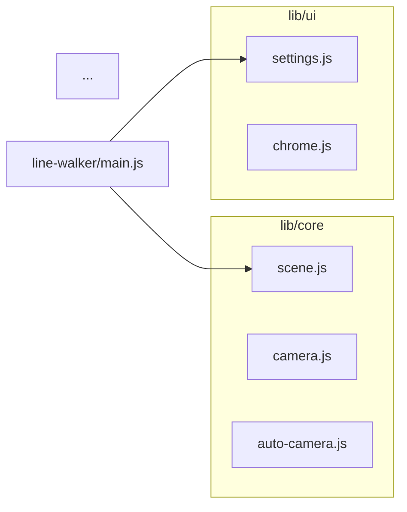

# 3D Interactive Scenes — Implementation Plan

> **For Claude:** REQUIRED SUB-SKILL: Use superpowers:executing-plans to implement this plan task-by-task.

**Goal:** Build four interactive 3D screensaver pages with a shared modular library, configurable settings with localStorage persistence, auto-hide UI, auto-camera screensaver mode, and deterministic architecture diagram generation with commit-hook enforcement.

**Architecture:** Pure ES modules served as static files on GitHub Pages. Shared library in `docs/3d/lib/`, four scene pages in `docs/3d/scenes/`, Three.js and lil-gui vendored in `docs/3d/vendor/`. Import maps in HTML resolve bare `'three'` specifiers. Dev tooling (node-based) generates Mermaid diagrams from AST and enforces ARCHITECTURE.md updates via pre-commit hook.

**Tech Stack:** Three.js r0.182.0, lil-gui 0.21.0, ES modules (no build step), acorn (dev tooling only)

**Design Doc:** `docs/plans/2026-02-10-3d-scenes-design.md`

**Known Limitations:**
- **Line width:** WebGL does not support `linewidth` on `THREE.Line` — it is always 1px regardless of the value set. Variable line width would require `Line2` from Three.js examples (5 additional vendor files + different geometry format). For v1, all scenes use 1px lines. This is a visual limitation but not a functional one. Line2 support can be added later without changing the scene logic, only the geometry/material setup.

---

## Task 1: Project Setup — Vendor Files, Package.json, Directory Structure

**Files:**
- Create: `docs/3d/vendor/three.module.js`
- Create: `docs/3d/vendor/three-addons/controls/OrbitControls.js`
- Create: `docs/3d/vendor/lil-gui.esm.js`
- Create: `docs/3d/css/scene.css`
- Create: `package.json`
- Create: `docs/3d/lib/core/.gitkeep` (establish directory)
- Create: `docs/3d/lib/ui/.gitkeep`
- Create: `docs/3d/lib/utils/.gitkeep`

**Step 1: Create directory structure**

```bash
cd /home/guy/code/git/github.com/shitchell/stuff
mkdir -p docs/{vendor/three-addons/controls,css,lib/{core,ui,utils},scenes/{line-walker,lorenz,wireframe-flythrough,reaction-diffusion},diagrams}
mkdir -p tools .githooks
```

**Step 2: Download vendor files**

```bash
curl -o docs/3d/vendor/three.module.js 'https://unpkg.com/three@0.182.0/build/three.module.js'
curl -o docs/3d/vendor/three-addons/controls/OrbitControls.js 'https://unpkg.com/three@0.182.0/examples/jsm/controls/OrbitControls.js'
curl -o docs/3d/vendor/lil-gui.esm.js 'https://unpkg.com/lil-gui@0.21.0/dist/lil-gui.esm.js'
```

**Step 3: Create package.json**

```json
{
  "name": "stuff-shitchell",
  "private": true,
  "type": "module",
  "scripts": {
    "diagrams": "node tools/generate-diagrams.mjs",
    "validate": "node tools/validate-architecture.mjs",
    "update-docs": "npm run diagrams && echo 'Now update ARCHITECTURE.md prose'",
    "serve": "npx serve docs"
  },
  "devDependencies": {
    "acorn": "^8.14.0",
    "acorn-walk": "^8.3.0"
  }
}
```

Note: We don't need dependency-cruiser as a dep — our custom acorn script handles everything.

**Step 4: Create shared CSS** (`docs/3d/css/scene.css`)

```css
/* === Reset & Full-Viewport Canvas === */
* { box-sizing: border-box; margin: 0; padding: 0; }

html, body {
    width: 100%;
    height: 100%;
    overflow: hidden;
    background: #000;
    font-family: system-ui, -apple-system, sans-serif;
    color: #e0e0e0;
}

canvas.scene-canvas {
    display: block;
    width: 100vw;
    height: 100vh;
}

/* === Chrome (UI overlay) auto-hide === */
.chrome {
    transition: opacity 0.4s ease;
    z-index: 100;
}

.chrome.chrome-hidden {
    opacity: 0;
    pointer-events: none;
}

.chrome.chrome-visible {
    opacity: 1;
    pointer-events: auto;
}

/* === Gear icon === */
.gear-icon {
    position: fixed;
    top: 12px;
    right: 12px;
    width: 32px;
    height: 32px;
    cursor: pointer;
    fill: #e0e0e0;
    opacity: 0.6;
    transition: opacity 0.2s;
}

.gear-icon:hover {
    opacity: 1;
}

/* === lil-gui theme overrides === */
.lil-gui {
    --background-color: rgba(26, 26, 46, 0.9);
    --widget-color: #2a2a4a;
    --focus-color: #ffd700;
    --hover-color: #3a3a5a;
    --font-family: system-ui, -apple-system, sans-serif;
    --font-size: 11px;
    --input-font-size: 11px;
    --title-background-color: rgba(26, 26, 46, 0.95);
    --title-text-color: #ffd700;
    --number-color: #6db3f2;
    --string-color: #6db3f2;

    position: fixed !important;
    top: 12px;
    right: 12px;
}

/* === Fullscreen info hint (shown briefly on load) === */
.fullscreen-hint {
    position: fixed;
    bottom: 20px;
    left: 50%;
    transform: translateX(-50%);
    padding: 8px 16px;
    background: rgba(26, 26, 46, 0.8);
    border-radius: 4px;
    font-size: 12px;
    color: #888;
    transition: opacity 0.4s ease;
    pointer-events: none;
}
```

**Step 5: Install dev dependencies**

```bash
npm install
```

**Step 6: Verify vendor files downloaded correctly**

```bash
head -5 docs/3d/vendor/three.module.js
head -5 docs/3d/vendor/lil-gui.esm.js
head -5 docs/3d/vendor/three-addons/controls/OrbitControls.js
```

Expected: Each file should contain JS code (not 404 HTML).

**Step 7: Commit**

```bash
git add docs/3d/vendor/ docs/3d/css/scene.css package.json package-lock.json
git commit -m "feat: project setup — vendor Three.js r182, lil-gui, shared CSS"
```

---

## Task 2: SceneManager + Camera Factories

**Files:**
- Create: `docs/3d/lib/core/scene.js`
- Create: `docs/3d/lib/core/camera.js`

**Step 1: Implement SceneManager** (`docs/3d/lib/core/scene.js`)

The SceneManager is the foundation every scene builds on. It owns the renderer, scene, camera, controls, animation loop, resize handling, and cleanup.

```js
import * as THREE from 'three';
import { OrbitControls } from 'three/addons/controls/OrbitControls.js';

/**
 * @typedef {Object} SceneOptions
 * @property {'perspective'|'orthographic'} [cameraType='perspective']
 * @property {number} [fov=75]
 * @property {number} [near=0.1]
 * @property {number} [far=1000]
 * @property {number|string} [background=0x000000]
 * @property {boolean} [antialias=true]
 * @property {boolean} [orbitControls=true]
 * @property {boolean} [orbitDamping=true]
 */

export class SceneManager {
    /** @type {THREE.Scene} */                          scene;
    /** @type {THREE.PerspectiveCamera|THREE.OrthographicCamera} */ camera;
    /** @type {THREE.WebGLRenderer} */                  renderer;
    /** @type {OrbitControls|null} */                    controls;
    /** @type {boolean} */                              running = false;

    #animationId = null;
    #canvas;
    #onResize;

    constructor(canvas, options = {}) {
        const {
            cameraType = 'perspective',
            fov = 75,
            near = 0.1,
            far = 1000,
            background = 0x000000,
            antialias = true,
            orbitControls = true,
            orbitDamping = true,
        } = options;

        this.#canvas = canvas;

        // Renderer
        this.renderer = new THREE.WebGLRenderer({ canvas, antialias });
        this.renderer.setPixelRatio(window.devicePixelRatio);
        this.renderer.setSize(window.innerWidth, window.innerHeight);

        // Scene
        this.scene = new THREE.Scene();
        this.scene.background = new THREE.Color(background);

        // Camera
        const aspect = window.innerWidth / window.innerHeight;
        if (cameraType === 'orthographic') {
            const frustum = fov; // reuse fov param as frustum half-size
            this.camera = new THREE.OrthographicCamera(
                -frustum * aspect, frustum * aspect,
                frustum, -frustum,
                near, far
            );
        } else {
            this.camera = new THREE.PerspectiveCamera(fov, aspect, near, far);
        }

        // Controls
        this.controls = null;
        if (orbitControls) {
            this.controls = new OrbitControls(this.camera, canvas);
            this.controls.enableDamping = orbitDamping;
        }

        // Resize
        this.#onResize = () => this.resize();
        window.addEventListener('resize', this.#onResize);
    }

    /** @param {(dt: number, elapsed: number) => void} updateFn */
    start(updateFn) {
        this.running = true;
        let last = performance.now();

        const loop = (now) => {
            if (!this.running) return;
            this.#animationId = requestAnimationFrame(loop);
            const dt = (now - last) / 1000;
            last = now;
            updateFn(dt, now / 1000);
            if (this.controls) this.controls.update();
            this.renderer.render(this.scene, this.camera);
        };

        this.#animationId = requestAnimationFrame(loop);
    }

    stop() {
        this.running = false;
        if (this.#animationId !== null) {
            cancelAnimationFrame(this.#animationId);
            this.#animationId = null;
        }
    }

    resize() {
        const w = window.innerWidth;
        const h = window.innerHeight;
        this.renderer.setSize(w, h);

        if (this.camera.isPerspectiveCamera) {
            this.camera.aspect = w / h;
        } else if (this.camera.isOrthographicCamera) {
            const aspect = w / h;
            const frustum = this.camera.top; // original half-size
            this.camera.left = -frustum * aspect;
            this.camera.right = frustum * aspect;
        }
        this.camera.updateProjectionMatrix();
    }

    dispose() {
        this.stop();
        window.removeEventListener('resize', this.#onResize);
        if (this.controls) this.controls.dispose();
        this.scene.traverse((obj) => {
            if (obj.geometry) obj.geometry.dispose();
            if (obj.material) {
                const materials = Array.isArray(obj.material) ? obj.material : [obj.material];
                materials.forEach(m => m.dispose());
            }
        });
        this.renderer.dispose();
    }
}
```

**Step 2: Implement camera factories** (`docs/3d/lib/core/camera.js`)

```js
import * as THREE from 'three';

/**
 * @param {number} [fov=75]
 * @param {number} [near=0.1]
 * @param {number} [far=1000]
 * @returns {THREE.PerspectiveCamera}
 */
export function createPerspectiveCamera(fov = 75, near = 0.1, far = 1000) {
    const aspect = window.innerWidth / window.innerHeight;
    return new THREE.PerspectiveCamera(fov, aspect, near, far);
}

/**
 * @param {number} [frustumSize=10]
 * @param {number} [near=-100]
 * @param {number} [far=100]
 * @returns {THREE.OrthographicCamera}
 */
export function createOrthographicCamera(frustumSize = 10, near = -100, far = 100) {
    const aspect = window.innerWidth / window.innerHeight;
    return new THREE.OrthographicCamera(
        -frustumSize * aspect, frustumSize * aspect,
        frustumSize, -frustumSize,
        near, far
    );
}

/**
 * Creates a fly-through camera controlled by WASD + mouse look.
 * Returns the camera and an update function to call each frame.
 *
 * @param {Object} options
 * @param {number} [options.speed=20]
 * @param {number} [options.near=0.1]
 * @param {number} [options.far=2000]
 * @param {number} [options.fov=75]
 * @param {HTMLElement} listenElement - Element to attach key/mouse listeners to
 * @returns {{ camera: THREE.PerspectiveCamera, update: (dt: number) => void, dispose: () => void, velocity: THREE.Vector3 }}
 */
export function createFlyCamera(options = {}, listenElement = document) {
    const { speed = 20, near = 0.1, far = 2000, fov = 75 } = options;
    const aspect = window.innerWidth / window.innerHeight;
    const camera = new THREE.PerspectiveCamera(fov, aspect, near, far);

    const velocity = new THREE.Vector3();
    const keys = {};
    const euler = new THREE.Euler(0, 0, 0, 'YXZ');

    const onKeyDown = (e) => { keys[e.code] = true; };
    const onKeyUp = (e) => { keys[e.code] = false; };
    const onMouseMove = (e) => {
        if (document.pointerLockElement !== listenElement) return;
        euler.setFromQuaternion(camera.quaternion);
        euler.y -= e.movementX * 0.002;
        euler.x -= e.movementY * 0.002;
        euler.x = Math.max(-Math.PI / 2, Math.min(Math.PI / 2, euler.x));
        camera.quaternion.setFromEuler(euler);
    };

    document.addEventListener('keydown', onKeyDown);
    document.addEventListener('keyup', onKeyUp);
    document.addEventListener('mousemove', onMouseMove);

    function update(dt) {
        const direction = new THREE.Vector3();
        if (keys['KeyW'] || keys['ArrowUp'])    direction.z -= 1;
        if (keys['KeyS'] || keys['ArrowDown'])  direction.z += 1;
        if (keys['KeyA'] || keys['ArrowLeft'])   direction.x -= 1;
        if (keys['KeyD'] || keys['ArrowRight']) direction.x += 1;
        if (keys['Space'])                       direction.y += 1;
        if (keys['ShiftLeft'])                   direction.y -= 1;

        direction.normalize().multiplyScalar(speed * dt);
        direction.applyQuaternion(camera.quaternion);
        camera.position.add(direction);
    }

    function dispose() {
        document.removeEventListener('keydown', onKeyDown);
        document.removeEventListener('keyup', onKeyUp);
        document.removeEventListener('mousemove', onMouseMove);
    }

    return { camera, update, dispose, velocity };
}
```

**Step 3: Create a minimal test page to verify** (`docs/3d/scenes/_test/index.html`)

```html
<!DOCTYPE html>
<html lang="en">
<head>
    <meta charset="UTF-8">
    <meta name="viewport" content="width=device-width, initial-scale=1.0">
    <title>Scene Test</title>
    <link rel="stylesheet" href="../../css/scene.css">
    <script type="importmap">
    {
        "imports": {
            "three": "../../vendor/three.module.js",
            "three/addons/": "../../vendor/three-addons/",
            "lil-gui": "../../vendor/lil-gui.esm.js"
        }
    }
    </script>
</head>
<body>
    <canvas class="scene-canvas" id="canvas"></canvas>
    <script type="module">
        import * as THREE from 'three';
        import { SceneManager } from '../../lib/core/scene.js';

        const mgr = new SceneManager(document.getElementById('canvas'));
        mgr.camera.position.set(0, 2, 5);

        const geo = new THREE.BoxGeometry();
        const mat = new THREE.MeshNormalMaterial();
        const cube = new THREE.Mesh(geo, mat);
        mgr.scene.add(cube);

        mgr.start((dt) => {
            cube.rotation.x += dt;
            cube.rotation.y += dt * 0.7;
        });
    </script>
</body>
</html>
```

**Step 4: Serve and verify**

```bash
npx serve docs
# Open http://localhost:3000/scenes/_test/ in browser
# Expected: spinning rainbow cube with orbit controls (drag to rotate)
```

**Step 5: Commit**

```bash
git add docs/3d/lib/core/scene.js docs/3d/lib/core/camera.js docs/3d/scenes/_test/
git commit -m "feat: SceneManager and camera factories with test page"
```

---

## Task 3: SettingsPanel

**Files:**
- Create: `docs/3d/lib/ui/settings.js`

**Step 1: Implement SettingsPanel** (`docs/3d/lib/ui/settings.js`)

Wraps lil-gui with localStorage persistence, namespaced by scene ID. Builder pattern (methods return `this` for chaining).

```js
import GUI from 'lil-gui';

/**
 * @typedef {Object} SettingDef
 * @property {string} key
 * @property {string} type - 'slider' | 'color' | 'toggle' | 'dropdown'
 * @property {*} defaultValue
 * @property {Object} [guiParams] - Extra params for lil-gui .add()
 */

export class SettingsPanel {
    /** @type {string} */            sceneId;
    /** @type {GUI} */               gui;
    /** @type {Object<string, *>} */ values = {};
    /** @type {Object<string, *>} */ defaults = {};
    /** @type {Object<string, Function[]>} */ #listeners = {};
    /** @type {Object<string, *>} */         #controllers = {};

    /**
     * @param {string} sceneId - Used as localStorage namespace
     * @param {Object} [options]
     * @param {string} [options.title='Settings']
     * @param {HTMLElement} [options.container]
     */
    constructor(sceneId, options = {}) {
        this.sceneId = sceneId;
        this.gui = new GUI({
            title: options.title || 'Settings',
            container: options.container,
        });
    }

    /** @returns {string} localStorage key for a setting */
    #storageKey(key) {
        return `scenes:${this.sceneId}:${key}`;
    }

    /** Load a single value from localStorage, falling back to default */
    #loadValue(key) {
        const stored = localStorage.getItem(this.#storageKey(key));
        if (stored !== null) {
            try {
                this.values[key] = JSON.parse(stored);
            } catch {
                this.values[key] = this.defaults[key];
            }
        }
    }

    /** Save a single value to localStorage */
    #saveValue(key) {
        localStorage.setItem(this.#storageKey(key), JSON.stringify(this.values[key]));
    }

    /** Notify listeners for a key */
    #notify(key, value) {
        (this.#listeners[key] || []).forEach(fn => fn(value));
    }

    /** Wire up a lil-gui controller to save on change and notify listeners */
    #wire(controller, key) {
        this.#controllers[key] = controller;
        controller.onChange((value) => {
            this.values[key] = value;
            this.#saveValue(key);
            this.#notify(key, value);
        });
        return this;
    }

    /**
     * Get the lil-gui controller for a key.
     * Useful for calling .enable() / .disable() to grey out dependent settings.
     * @param {string} key
     * @returns {*} lil-gui controller
     */
    controller(key) {
        return this.#controllers[key];
    }

    /**
     * @param {string} key
     * @param {string} label
     * @param {number} min
     * @param {number} max
     * @param {number} step
     * @param {number} defaultValue
     * @returns {this}
     */
    addSlider(key, label, min, max, step, defaultValue) {
        this.defaults[key] = defaultValue;
        this.values[key] = defaultValue;
        this.#loadValue(key);
        const obj = { [label]: this.values[key] };
        const ctrl = this.gui.add(obj, label, min, max, step);
        return this.#wire(ctrl, key);
    }

    /**
     * @param {string} key
     * @param {string} label
     * @param {string} defaultValue - hex color string, e.g. '#ff0000'
     * @returns {this}
     */
    addColor(key, label, defaultValue) {
        this.defaults[key] = defaultValue;
        this.values[key] = defaultValue;
        this.#loadValue(key);
        const obj = { [label]: this.values[key] };
        const ctrl = this.gui.addColor(obj, label);
        return this.#wire(ctrl, key);
    }

    /**
     * @param {string} key
     * @param {string} label
     * @param {boolean} defaultValue
     * @returns {this}
     */
    addToggle(key, label, defaultValue) {
        this.defaults[key] = defaultValue;
        this.values[key] = defaultValue;
        this.#loadValue(key);
        const obj = { [label]: this.values[key] };
        const ctrl = this.gui.add(obj, label);
        return this.#wire(ctrl, key);
    }

    /**
     * @param {string} key
     * @param {string} label
     * @param {string[]|Object<string, *>} options
     * @param {*} defaultValue
     * @returns {this}
     */
    addDropdown(key, label, options, defaultValue) {
        this.defaults[key] = defaultValue;
        this.values[key] = defaultValue;
        this.#loadValue(key);
        const obj = { [label]: this.values[key] };
        const ctrl = this.gui.add(obj, label, options);
        return this.#wire(ctrl, key);
    }

    /**
     * @param {string} label
     * @param {Function} callback
     * @returns {this}
     */
    addButton(label, callback) {
        this.gui.add({ [label]: callback }, label);
        return this;
    }

    /** @returns {this} */
    addSeparator() {
        // lil-gui doesn't have native separators; use a folder trick or skip
        return this;
    }

    /**
     * @param {string} key
     * @returns {*}
     */
    get(key) {
        return this.values[key];
    }

    /**
     * @param {string} key
     * @param {Function} callback
     */
    onChange(key, callback) {
        if (!this.#listeners[key]) this.#listeners[key] = [];
        this.#listeners[key].push(callback);
    }

    /** Reset all values to defaults and clear localStorage */
    reset() {
        for (const key of Object.keys(this.defaults)) {
            this.values[key] = this.defaults[key];
            localStorage.removeItem(this.#storageKey(key));
        }
        // Rebuild GUI to reflect defaults
        this.gui.controllersRecursive().forEach(c => c.updateDisplay());
    }

    /** Get the GUI's DOM element (for ChromeController registration) */
    get domElement() {
        return this.gui.domElement;
    }

    destroy() {
        this.gui.destroy();
    }
}
```

**Step 2: Update test page to include settings**

Add to `docs/3d/scenes/_test/index.html`'s script:

```js
import { SettingsPanel } from '../../lib/ui/settings.js';

const settings = new SettingsPanel('test');
settings
    .addSlider('speed', 'Rotation Speed', 0.1, 5, 0.1, 1)
    .addColor('cubeColor', 'Cube Color', '#44aa88')
    .addToggle('wireframe', 'Wireframe', false);

settings.onChange('cubeColor', (val) => mat.color.set(val));
settings.onChange('wireframe', (val) => { mat.wireframe = val; });

// Use settings.get('speed') in the update loop
mgr.start((dt) => {
    const s = settings.get('speed');
    cube.rotation.x += dt * s;
    cube.rotation.y += dt * s * 0.7;
});
```

**Step 3: Serve and verify**

```bash
npx serve docs
# Open http://localhost:3000/scenes/_test/
# Expected: lil-gui panel in top-right with sliders, color picker, toggle
# Change values, refresh page — values should persist via localStorage
```

**Step 4: Commit**

```bash
git add docs/3d/lib/ui/settings.js docs/3d/scenes/_test/
git commit -m "feat: SettingsPanel with localStorage persistence"
```

---

## Task 4: ChromeController

**Files:**
- Create: `docs/3d/lib/ui/chrome.js`

**Step 1: Implement ChromeController** (`docs/3d/lib/ui/chrome.js`)

Auto-hides registered UI elements after inactivity. Also handles fullscreen toggle via `F` key and double-click.

```js
/**
 * @typedef {Object} ChromeOptions
 * @property {number} [timeout=3000] - ms of inactivity before hiding
 * @property {Function} [onIdle] - called when inactivity timeout fires (used by AutoCamera)
 * @property {Function} [onActive] - called when user becomes active again
 */

export class ChromeController {
    /** @type {HTMLElement[]} */ #elements;
    /** @type {number} */       #timeout;
    /** @type {number|null} */  #timerId = null;
    /** @type {boolean} */      #visible = true;
    /** @type {Function|null} */ #onIdle;
    /** @type {Function|null} */ #onActive;

    /**
     * @param {HTMLElement[]} elements - DOM elements to show/hide
     * @param {ChromeOptions} [options]
     */
    constructor(elements, options = {}) {
        this.#elements = elements;
        this.#timeout = options.timeout ?? 3000;
        this.#onIdle = options.onIdle ?? null;
        this.#onActive = options.onActive ?? null;

        // Add chrome classes
        this.#elements.forEach(el => {
            el.classList.add('chrome', 'chrome-visible');
        });

        // Bind handlers
        this._onActivity = () => this.#handleActivity();
        this._onKeyDown = (e) => this.#handleKeyDown(e);
        this._onDblClick = () => this.#toggleFullscreen();

        document.addEventListener('mousemove', this._onActivity);
        document.addEventListener('keydown', this._onActivity);
        document.addEventListener('touchstart', this._onActivity);
        document.addEventListener('keydown', this._onKeyDown);
        document.addEventListener('dblclick', this._onDblClick);

        this.resetTimer();
    }

    #handleActivity() {
        if (!this.#visible) {
            this.show();
            if (this.#onActive) this.#onActive();
        }
        this.resetTimer();
    }

    #handleKeyDown(e) {
        // Don't intercept F key when user is typing in a lil-gui input field
        const tag = document.activeElement?.tagName;
        if (tag === 'INPUT' || tag === 'TEXTAREA' || tag === 'SELECT') return;

        if (e.code === 'KeyF' && !e.ctrlKey && !e.metaKey && !e.altKey) {
            e.preventDefault();
            this.#toggleFullscreen();
        }
    }

    #toggleFullscreen() {
        if (document.fullscreenElement) {
            document.exitFullscreen();
        } else {
            document.documentElement.requestFullscreen().catch(() => {});
        }
    }

    show() {
        this.#visible = true;
        this.#elements.forEach(el => {
            el.classList.remove('chrome-hidden');
            el.classList.add('chrome-visible');
        });
    }

    hide() {
        this.#visible = false;
        this.#elements.forEach(el => {
            el.classList.remove('chrome-visible');
            el.classList.add('chrome-hidden');
        });
        if (this.#onIdle) this.#onIdle();
    }

    resetTimer() {
        if (this.#timerId !== null) clearTimeout(this.#timerId);
        this.#timerId = setTimeout(() => this.hide(), this.#timeout);
    }

    destroy() {
        if (this.#timerId !== null) clearTimeout(this.#timerId);
        document.removeEventListener('mousemove', this._onActivity);
        document.removeEventListener('keydown', this._onActivity);
        document.removeEventListener('touchstart', this._onActivity);
        document.removeEventListener('keydown', this._onKeyDown);
        document.removeEventListener('dblclick', this._onDblClick);
    }
}
```

**Step 2: Update test page to wire ChromeController**

Add to `docs/3d/scenes/_test/index.html`'s script:

```js
import { ChromeController } from '../../lib/ui/chrome.js';

const chrome = new ChromeController([settings.domElement], {
    timeout: 3000,
    onIdle: () => console.log('User idle — chrome hidden'),
    onActive: () => console.log('User active — chrome shown'),
});
```

**Step 3: Verify**

```bash
npx serve docs
# Open test page, wait 3 seconds without moving mouse
# Expected: settings panel fades out
# Move mouse: panel fades back in
# Press F: browser goes fullscreen
# Double-click: toggles fullscreen
```

**Step 4: Commit**

```bash
git add docs/3d/lib/ui/chrome.js docs/3d/scenes/_test/
git commit -m "feat: ChromeController with auto-hide and fullscreen"
```

---

## Task 5: Math + Color Utilities

**Files:**
- Create: `docs/3d/lib/utils/math.js`
- Create: `docs/3d/lib/utils/color.js`

**Step 1: Implement math utilities** (`docs/3d/lib/utils/math.js`)

```js
/** @param {number} a @param {number} b @param {number} t @returns {number} */
export function lerp(a, b, t) {
    return a + (b - a) * t;
}

/** @param {number} v @param {number} min @param {number} max @returns {number} */
export function clamp(v, min, max) {
    return Math.min(Math.max(v, min), max);
}

/**
 * Map a value from one range to another.
 * @param {number} v @param {number} inMin @param {number} inMax
 * @param {number} outMin @param {number} outMax @returns {number}
 */
export function map(v, inMin, inMax, outMin, outMax) {
    return outMin + ((v - inMin) / (inMax - inMin)) * (outMax - outMin);
}

/** @param {number} min @param {number} max @returns {number} */
export function randomRange(min, max) {
    return min + Math.random() * (max - min);
}
```

**Step 2: Implement color utilities** (`docs/3d/lib/utils/color.js`)

```js
/**
 * Convert HSL to hex string.
 * @param {number} h - Hue 0-360
 * @param {number} s - Saturation 0-100
 * @param {number} l - Lightness 0-100
 * @returns {string} Hex color string, e.g. '#ff0000'
 */
export function hslToHex(h, s, l) {
    s /= 100;
    l /= 100;
    const k = (n) => (n + h / 30) % 12;
    const a = s * Math.min(l, 1 - l);
    const f = (n) => l - a * Math.max(-1, Math.min(k(n) - 3, Math.min(9 - k(n), 1)));
    const toHex = (x) => Math.round(x * 255).toString(16).padStart(2, '0');
    return `#${toHex(f(0))}${toHex(f(8))}${toHex(f(4))}`;
}

/** Built-in color palettes. Each is an array of hex color stops. */
const PALETTES = {
    rainbow: ['#ff0000', '#ff8800', '#ffff00', '#00ff00', '#0088ff', '#8800ff'],
    neon:    ['#ff00ff', '#00ffff', '#ff00ff'],
    fire:    ['#000000', '#ff4400', '#ffaa00', '#ffff44'],
    ocean:   ['#000033', '#003366', '#0066cc', '#00aaff', '#66ddff'],
    thermal: ['#000033', '#6600cc', '#ff0066', '#ffaa00', '#ffffff'],
    mono:    ['#000000', '#ffffff'],
};

/**
 * Get a palette by name.
 * @param {string} name
 * @returns {string[]} Array of hex color stops
 */
export function palette(name) {
    return PALETTES[name] || PALETTES.rainbow;
}

/**
 * Sample a color from a palette at position t (0-1).
 * Linearly interpolates between stops.
 * @param {number} t - Position in palette, 0.0 to 1.0
 * @param {string[]|string} pal - Palette array or palette name
 * @returns {string} Hex color
 */
export function colorRamp(t, pal = 'rainbow') {
    const stops = typeof pal === 'string' ? palette(pal) : pal;
    const n = stops.length - 1;
    const i = Math.min(Math.floor(t * n), n - 1);
    const f = (t * n) - i;

    const a = hexToRgb(stops[i]);
    const b = hexToRgb(stops[i + 1]);

    const r = Math.round(a.r + (b.r - a.r) * f);
    const g = Math.round(a.g + (b.g - a.g) * f);
    const bl = Math.round(a.b + (b.b - a.b) * f);

    return `#${r.toString(16).padStart(2, '0')}${g.toString(16).padStart(2, '0')}${bl.toString(16).padStart(2, '0')}`;
}

/**
 * Parse hex color to RGB object.
 * @param {string} hex
 * @returns {{ r: number, g: number, b: number }}
 */
function hexToRgb(hex) {
    const n = parseInt(hex.slice(1), 16);
    return { r: (n >> 16) & 0xff, g: (n >> 8) & 0xff, b: n & 0xff };
}
```

**Step 3: Verify with quick node test**

```bash
node -e "
import { lerp, clamp, map, randomRange } from './docs/3d/lib/utils/math.js';
import { hslToHex, colorRamp } from './docs/3d/lib/utils/color.js';
console.log('lerp(0,10,0.5):', lerp(0, 10, 0.5));       // 5
console.log('clamp(15,0,10):', clamp(15, 0, 10));         // 10
console.log('map(5,0,10,0,100):', map(5, 0, 10, 0, 100)); // 50
console.log('hslToHex(0,100,50):', hslToHex(0, 100, 50)); // #ff0000
console.log('colorRamp(0.5):', colorRamp(0.5));            // greenish
console.log('All utils OK');
"
```

Expected: Values printed, no errors.

Note: This requires running from the project root with `--input-type=module` or using the package.json `"type": "module"`. If bare `'three'` import in transitive deps causes issues, test via browser instead.

**Step 4: Commit**

```bash
git add docs/3d/lib/utils/math.js docs/3d/lib/utils/color.js
git commit -m "feat: math and color utility modules"
```

---

## Task 6: Line Walker Scene

**Files:**
- Create: `docs/3d/scenes/line-walker/index.html`
- Create: `docs/3d/scenes/line-walker/main.js`
- Create: `docs/3d/scenes/line-walker/walker.js`

This is the first full scene and validates the entire shared library stack.

**Step 1: Create the walker logic** (`docs/3d/scenes/line-walker/walker.js`)

The walker maintains a growing trail of 3D points. Each step picks a new direction: a random vector blended with the previous direction based on a "bias" parameter (higher bias = straighter path).

```js
import * as THREE from 'three';
import { randomRange } from '../../lib/utils/math.js';

/**
 * @typedef {Object} WalkerOptions
 * @property {number} [stepLength=0.5]
 * @property {number} [bias=0.6] - 0 = fully random, 1 = perfectly straight
 * @property {number} [maxPoints=50000]
 */

export class Walker {
    /** @type {THREE.Vector3} */     position;
    /** @type {THREE.Vector3} */     direction;
    /** @type {Float32Array} */      positions;
    /** @type {number} */            pointCount = 0;
    /** @type {THREE.BufferGeometry} */ geometry;
    /** @type {number} */            stepLength;
    /** @type {number} */            bias;
    /** @type {number} */            maxPoints;

    /** @param {WalkerOptions} [options] */
    constructor(options = {}) {
        this.stepLength = options.stepLength ?? 0.5;
        this.bias = options.bias ?? 0.6;
        this.maxPoints = options.maxPoints ?? 50000;

        this.position = new THREE.Vector3(0, 0, 0);
        this.direction = new THREE.Vector3(
            randomRange(-1, 1), randomRange(-1, 1), randomRange(-1, 1)
        ).normalize();

        // Pre-allocate buffer
        this.positions = new Float32Array(this.maxPoints * 3);
        this.positions[0] = 0;
        this.positions[1] = 0;
        this.positions[2] = 0;
        this.pointCount = 1;

        this.geometry = new THREE.BufferGeometry();
        this.geometry.setAttribute(
            'position',
            new THREE.BufferAttribute(this.positions, 3)
        );
        this.geometry.setDrawRange(0, this.pointCount);
    }

    /** Advance one step. Returns false if buffer is full. */
    step() {
        if (this.pointCount >= this.maxPoints) return false;

        // Generate random direction
        const random = new THREE.Vector3(
            randomRange(-1, 1), randomRange(-1, 1), randomRange(-1, 1)
        ).normalize();

        // Blend with previous direction based on bias
        this.direction.lerp(random, 1 - this.bias).normalize();

        // Move
        this.position.addScaledVector(this.direction, this.stepLength);

        // Write to buffer
        const i = this.pointCount * 3;
        this.positions[i]     = this.position.x;
        this.positions[i + 1] = this.position.y;
        this.positions[i + 2] = this.position.z;
        this.pointCount++;

        // Update draw range
        this.geometry.setDrawRange(0, this.pointCount);
        this.geometry.attributes.position.needsUpdate = true;

        return true;
    }

    /** Get the current tip position (for auto-camera targeting) */
    get tip() {
        return this.position.clone();
    }

    /** Reset the walker to origin */
    reset() {
        this.position.set(0, 0, 0);
        this.direction.set(
            randomRange(-1, 1), randomRange(-1, 1), randomRange(-1, 1)
        ).normalize();
        this.positions[0] = 0;
        this.positions[1] = 0;
        this.positions[2] = 0;
        this.pointCount = 1;
        this.geometry.setDrawRange(0, 1);
        this.geometry.attributes.position.needsUpdate = true;
    }
}
```

**Step 2: Create the scene main** (`docs/3d/scenes/line-walker/main.js`)

```js
import * as THREE from 'three';
import { SceneManager } from '../../lib/core/scene.js';
import { SettingsPanel } from '../../lib/ui/settings.js';
import { ChromeController } from '../../lib/ui/chrome.js';
import { colorRamp, hslToHex } from '../../lib/utils/color.js';
import { randomRange } from '../../lib/utils/math.js';
import { Walker } from './walker.js';

// --- Scene ---
const canvas = document.getElementById('canvas');
const mgr = new SceneManager(canvas, { background: 0x0a0a1a });
mgr.camera.position.set(10, 10, 10);
mgr.controls.target.set(0, 0, 0);

// --- Settings ---
const settings = new SettingsPanel('line-walker', { title: 'Line Walker' });
settings
    .addSlider('speed', 'Speed (steps/s)', 1, 200, 1, 60)
    .addSlider('stepLength', 'Step Length', 0.05, 2, 0.05, 0.5)
    .addSlider('bias', 'Direction Bias', 0, 1, 0.01, 0.6)
    .addDropdown('colorMode', 'Color Mode', {
        'Rainbow Gradient': 'rainbow',
        'Single Color': 'single',
        'Random Per Segment': 'random',
    }, 'rainbow')
    .addColor('singleColor', 'Color (single mode)', '#00aaff')
    .addSlider('trailLength', 'Trail Length (0=inf)', 0, 10000, 100, 0)
    .addToggle('paused', 'Paused', false)
    .addButton('Reset', () => {
        walker.reset();
        stepAccumulator = 0;
    });

// Color mode note: The three modes work as follows:
// - 'rainbow': Hue cycles smoothly as the line grows (uses colorRamp with 'rainbow' palette)
// - 'single': Entire line is one color, set by the 'singleColor' color picker
// - 'random': Each segment gets a random hue (randomRange(0, 360) → hslToHex)

// --- Chrome ---
const chrome = new ChromeController([settings.domElement]);

// --- Walker ---
let walker = new Walker({
    stepLength: settings.get('stepLength'),
    bias: settings.get('bias'),
});

// Line material — we'll use vertex colors for the gradient
const lineMaterial = new THREE.LineBasicMaterial({ vertexColors: true });

// Allocate color buffer matching position buffer
const colors = new Float32Array(walker.maxPoints * 3);
const colorAttr = new THREE.BufferAttribute(colors, 3);
walker.geometry.setAttribute('color', colorAttr);

const line = new THREE.Line(walker.geometry, lineMaterial);
mgr.scene.add(line);

// React to settings changes
settings.onChange('stepLength', (v) => { walker.stepLength = v; });
settings.onChange('bias', (v) => { walker.bias = v; });

// --- Animation ---
let stepAccumulator = 0;

mgr.start((dt) => {
    if (settings.get('paused')) return;

    const speed = settings.get('speed');
    stepAccumulator += dt * speed;

    while (stepAccumulator >= 1) {
        stepAccumulator -= 1;

        if (!walker.step()) {
            // Buffer full — shift or wrap
            walker.reset();
        }

        // Color the new point based on color mode
        const mode = settings.get('colorMode');
        let c;
        if (mode === 'rainbow') {
            const t = (walker.pointCount / walker.maxPoints) % 1;
            c = new THREE.Color(colorRamp(t, 'rainbow'));
        } else if (mode === 'single') {
            c = new THREE.Color(settings.get('singleColor'));
        } else if (mode === 'random') {
            c = new THREE.Color(hslToHex(randomRange(0, 360), 80, 60));
        }
        const ci = (walker.pointCount - 1) * 3;
        colors[ci]     = c.r;
        colors[ci + 1] = c.g;
        colors[ci + 2] = c.b;
        colorAttr.needsUpdate = true;
    }

    // Trail length trimming
    const trail = settings.get('trailLength');
    if (trail > 0 && walker.pointCount > trail) {
        walker.geometry.setDrawRange(walker.pointCount - trail, trail);
    }
});
```

**Step 3: Create the HTML page** (`docs/3d/scenes/line-walker/index.html`)

```html
<!DOCTYPE html>
<html lang="en">
<head>
    <meta charset="UTF-8">
    <meta name="viewport" content="width=device-width, initial-scale=1.0">
    <title>Line Walker</title>
    <link rel="stylesheet" href="../../css/scene.css">
    <script type="importmap">
    {
        "imports": {
            "three": "../../vendor/three.module.js",
            "three/addons/": "../../vendor/three-addons/",
            "lil-gui": "../../vendor/lil-gui.esm.js"
        }
    }
    </script>
</head>
<body>
    <canvas class="scene-canvas" id="canvas"></canvas>
    <script type="module" src="./main.js"></script>
</body>
</html>
```

**Step 4: Serve and verify**

```bash
npx serve docs
# Open http://localhost:3000/scenes/line-walker/
# Expected:
# - Line growing from origin with rainbow color gradient
# - Settings panel in top-right with working sliders
# - Drag to orbit, scroll to zoom
# - Panel auto-hides after 3s of inactivity
# - F key toggles fullscreen
# - Changing Speed slider changes growth rate immediately
# - Refresh page — settings persist
```

**Step 5: Commit**

```bash
git add docs/3d/scenes/line-walker/
git commit -m "feat: line walker scene — first complete interactive page"
```

---

## Task 7: Lorenz Attractor Scene

**Files:**
- Create: `docs/3d/scenes/lorenz/index.html`
- Create: `docs/3d/scenes/lorenz/main.js`
- Create: `docs/3d/scenes/lorenz/attractor.js`

**Step 1: Implement the attractor** (`docs/3d/scenes/lorenz/attractor.js`)

Uses RK4 integration for the Lorenz system. Supports multiple trails with slightly offset initial conditions.

```js
import * as THREE from 'three';

/**
 * Lorenz system parameters.
 * @typedef {Object} LorenzParams
 * @property {number} sigma
 * @property {number} rho
 * @property {number} beta
 */

/** Named parameter presets */
export const PRESETS = {
    classic:  { sigma: 10,  rho: 28,    beta: 8 / 3 },
    chaotic:  { sigma: 10,  rho: 99.96, beta: 8 / 3 },
    periodic: { sigma: 10,  rho: 13.96, beta: 8 / 3 },
};

export class LorenzTrail {
    /** @type {THREE.Vector3} */ state;
    /** @type {Float32Array} */ positions;
    /** @type {Float32Array} */ colors;
    /** @type {number} */       pointCount = 0;
    /** @type {number} */       maxPoints;
    /** @type {THREE.BufferGeometry} */ geometry;

    /**
     * @param {THREE.Vector3} initialState
     * @param {number} [maxPoints=100000]
     */
    constructor(initialState, maxPoints = 100000) {
        this.state = initialState.clone();
        this.maxPoints = maxPoints;
        this.positions = new Float32Array(maxPoints * 3);
        this.colors = new Float32Array(maxPoints * 3);

        this.positions[0] = this.state.x;
        this.positions[1] = this.state.y;
        this.positions[2] = this.state.z;
        this.pointCount = 1;

        this.geometry = new THREE.BufferGeometry();
        this.geometry.setAttribute('position', new THREE.BufferAttribute(this.positions, 3));
        this.geometry.setAttribute('color', new THREE.BufferAttribute(this.colors, 3));
        this.geometry.setDrawRange(0, 1);
    }

    /**
     * Advance the system by dt using RK4.
     * @param {LorenzParams} params
     * @param {number} dt
     * @param {THREE.Color} color - color for the new point
     */
    step(params, dt, color) {
        if (this.pointCount >= this.maxPoints) return false;

        const { sigma, rho, beta } = params;
        const { x, y, z } = this.state;

        // Lorenz system derivatives
        const f = (x, y, z) => [
            sigma * (y - x),
            x * (rho - z) - y,
            x * y - beta * z,
        ];

        // RK4
        const k1 = f(x, y, z);
        const k2 = f(x + k1[0]*dt/2, y + k1[1]*dt/2, z + k1[2]*dt/2);
        const k3 = f(x + k2[0]*dt/2, y + k2[1]*dt/2, z + k2[2]*dt/2);
        const k4 = f(x + k3[0]*dt, y + k3[1]*dt, z + k3[2]*dt);

        this.state.x += (k1[0] + 2*k2[0] + 2*k3[0] + k4[0]) * dt / 6;
        this.state.y += (k1[1] + 2*k2[1] + 2*k3[1] + k4[1]) * dt / 6;
        this.state.z += (k1[2] + 2*k2[2] + 2*k3[2] + k4[2]) * dt / 6;

        // Write position
        const i = this.pointCount * 3;
        this.positions[i]     = this.state.x;
        this.positions[i + 1] = this.state.y;
        this.positions[i + 2] = this.state.z;

        // Write color
        this.colors[i]     = color.r;
        this.colors[i + 1] = color.g;
        this.colors[i + 2] = color.b;

        this.pointCount++;
        this.geometry.setDrawRange(0, this.pointCount);
        this.geometry.attributes.position.needsUpdate = true;
        this.geometry.attributes.color.needsUpdate = true;

        return true;
    }

    /** Reset to a new initial state */
    reset(initialState) {
        this.state = initialState.clone();
        this.positions[0] = this.state.x;
        this.positions[1] = this.state.y;
        this.positions[2] = this.state.z;
        this.pointCount = 1;
        this.geometry.setDrawRange(0, 1);
        this.geometry.attributes.position.needsUpdate = true;
    }
}
```

**Step 2: Create scene main** (`docs/3d/scenes/lorenz/main.js`)

```js
import * as THREE from 'three';
import { SceneManager } from '../../lib/core/scene.js';
import { SettingsPanel } from '../../lib/ui/settings.js';
import { ChromeController } from '../../lib/ui/chrome.js';
import { hslToHex } from '../../lib/utils/color.js';
import { LorenzTrail, PRESETS } from './attractor.js';

// --- Scene ---
const canvas = document.getElementById('canvas');
const mgr = new SceneManager(canvas, { background: 0x0a0a1a });
mgr.camera.position.set(0, 0, 80);
mgr.controls.target.set(0, 0, 25);

// --- Trail management ---
// Trails are stored in an array. When trail count changes, we add/remove
// trails to match. Each trail gets a slightly offset initial condition.
const BASE_INITIAL = new THREE.Vector3(1, 1, 1);
let trails = [];
const trailLines = [];

function getInitialState(index) {
    // Each trail offset by 0.001 * index in x, for sensitivity demo
    return new THREE.Vector3(
        BASE_INITIAL.x + index * 0.001,
        BASE_INITIAL.y,
        BASE_INITIAL.z,
    );
}

// Fixed colors for multi-trail mode (one per trail, from palette)
const TRAIL_COLORS = [
    new THREE.Color('#ff4444'),
    new THREE.Color('#44aaff'),
    new THREE.Color('#44ff88'),
    new THREE.Color('#ffaa44'),
    new THREE.Color('#ff44ff'),
];

function rebuildTrails(count) {
    // Remove old
    trailLines.forEach(line => mgr.scene.remove(line));
    trails.forEach(t => t.geometry.dispose());
    trails.length = 0;
    trailLines.length = 0;

    // Create new
    for (let i = 0; i < count; i++) {
        const trail = new LorenzTrail(getInitialState(i));
        trails.push(trail);
        const mat = new THREE.LineBasicMaterial({ vertexColors: true });
        const line = new THREE.Line(trail.geometry, mat);
        trailLines.push(line);
        mgr.scene.add(line);
    }
}

// --- Settings ---
// IMPORTANT: Preset and individual sigma/rho/beta sliders are LOCKED TOGETHER.
// Selecting a preset updates the sliders to match.
// Manually changing a slider does NOT change the preset dropdown label
// (the dropdown just shows the last-selected preset).
const settings = new SettingsPanel('lorenz', { title: 'Lorenz Attractor' });
settings
    .addDropdown('preset', 'Preset', ['classic', 'chaotic', 'periodic'], 'classic')
    .addSlider('sigma', 'Sigma', 1, 30, 0.1, PRESETS.classic.sigma)
    .addSlider('rho', 'Rho', 1, 120, 0.1, PRESETS.classic.rho)
    .addSlider('beta', 'Beta', 0.1, 10, 0.01, PRESETS.classic.beta)
    .addSlider('speed', 'Speed', 1, 100, 1, 30)
    .addSlider('trailCount', 'Trail Count', 1, 5, 1, 1)
    .addSlider('trailLength', 'Trail Length (0=inf)', 0, 50000, 500, 0)
    .addDropdown('colorMode', 'Color Mode', {
        'By Velocity': 'velocity',
        'By Time': 'time',
        'Fixed Per Trail': 'fixed',
    }, 'velocity')
    .addToggle('paused', 'Paused', false)
    .addButton('Reset', () => rebuildTrails(settings.get('trailCount')));

// When preset changes, update the sigma/rho/beta sliders
settings.onChange('preset', (name) => {
    const p = PRESETS[name];
    if (p) {
        // Update internal values AND the GUI display
        settings.values.sigma = p.sigma;
        settings.values.rho = p.rho;
        settings.values.beta = p.beta;
        // Force lil-gui to refresh its display
        settings.gui.controllersRecursive().forEach(c => c.updateDisplay());
    }
});

// When trail count changes, rebuild all trails
settings.onChange('trailCount', (count) => rebuildTrails(count));

// --- Chrome ---
const chrome = new ChromeController([settings.domElement]);

// --- Initialize ---
rebuildTrails(settings.get('trailCount'));

// --- Animation ---
mgr.start((dt, elapsed) => {
    if (settings.get('paused')) return;

    const speed = settings.get('speed');
    const params = {
        sigma: settings.get('sigma'),
        rho: settings.get('rho'),
        beta: settings.get('beta'),
    };
    const colorMode = settings.get('colorMode');
    const simDt = 0.005; // fixed integration timestep
    const stepsPerFrame = Math.round(speed);

    for (const [i, trail] of trails.entries()) {
        for (let s = 0; s < stepsPerFrame; s++) {
            // Compute color for this point based on mode
            let color;
            if (colorMode === 'velocity') {
                // Color by speed: compute derivative magnitude
                const { sigma, rho, beta } = params;
                const { x, y, z } = trail.state;
                const dx = sigma * (y - x);
                const dy = x * (rho - z) - y;
                const dz = x * y - beta * z;
                const spd = Math.sqrt(dx*dx + dy*dy + dz*dz);
                // Map speed to hue: 0 (slow=blue) to 200 (fast=red)
                const hue = Math.max(0, 240 - spd * 2);
                color = new THREE.Color(hslToHex(hue, 90, 55));
            } else if (colorMode === 'time') {
                // Hue cycles over time
                const hue = ((elapsed * 20) + i * 60) % 360;
                color = new THREE.Color(hslToHex(hue, 80, 55));
            } else {
                // Fixed color per trail
                color = TRAIL_COLORS[i % TRAIL_COLORS.length];
            }

            if (!trail.step(params, simDt, color)) {
                trail.reset(getInitialState(i));
            }
        }

        // Trail length trimming (same pattern as line-walker)
        const trailLen = settings.get('trailLength');
        if (trailLen > 0 && trail.pointCount > trailLen) {
            trail.geometry.setDrawRange(trail.pointCount - trailLen, trailLen);
        }
    }
});
```

**Key behaviors:**
- Selecting a preset (e.g., "chaotic") immediately updates the sigma/rho/beta sliders to show the preset values.
- Manually tweaking a slider (e.g., setting rho to 30) still works — the preset dropdown just continues showing the last-selected preset name. The simulation uses the slider values directly.
- Changing trail count destroys all existing trails and creates new ones (clean rebuild, no stale geometry).
- The integration timestep is fixed at 0.005 (stable for all presets). The "speed" setting controls how many steps run per frame, not the timestep itself.

**Step 3: Create HTML page** (`docs/3d/scenes/lorenz/index.html`)

Same pattern as line-walker: importmap, scene.css link, canvas, module script src.

**Step 4: Serve and verify**

```bash
npx serve docs
# Open http://localhost:3000/scenes/lorenz/
# Expected:
# - Lorenz butterfly emerging as trail grows
# - Dropdown switches between classic/chaotic/periodic presets
# - Multiple trails show divergence (increase trail count)
# - Color changes based on mode selection
# - All settings persist in localStorage
```

**Step 5: Commit**

```bash
git add docs/3d/scenes/lorenz/
git commit -m "feat: lorenz attractor scene with RK4 integration and multi-trail"
```

---

## Task 8: Simplex Noise Utility

**Files:**
- Create: `docs/3d/lib/utils/noise.js`

**Step 1: Implement simplex noise** (`docs/3d/lib/utils/noise.js`)

Implement 2D and 3D simplex noise. Use the well-known public domain algorithm by Stefan Gustavson. This is a self-contained implementation with no dependencies.

The module should export:
- `simplex2D(x, y)` → returns float in range [-1, 1]
- `simplex3D(x, y, z)` → returns float in range [-1, 1]

Include the permutation table, gradient vectors, and the simplex noise algorithm. There are many clean reference implementations available; use Gustavson's approach with the mod-based permutation table (no seed needed for now — the terrain uses spatial coordinates as input, so different positions give different values).

Optionally export a `createNoise(seed)` factory that returns `{ simplex2D, simplex3D }` with a seeded permutation table, for reproducible results.

**Step 2: Quick verification**

```bash
node -e "
import { simplex2D, simplex3D } from './docs/3d/lib/utils/noise.js';
const v2 = simplex2D(1.5, 2.3);
const v3 = simplex3D(1.5, 2.3, 0.7);
console.log('simplex2D(1.5, 2.3):', v2, '(should be between -1 and 1)');
console.log('simplex3D(1.5, 2.3, 0.7):', v3, '(should be between -1 and 1)');
console.log(Math.abs(v2) <= 1 && Math.abs(v3) <= 1 ? 'PASS' : 'FAIL');
"
```

**Step 3: Commit**

```bash
git add docs/3d/lib/utils/noise.js
git commit -m "feat: simplex noise utility (2D and 3D)"
```

---

## Task 9: Wireframe Flythrough Scene

**Files:**
- Create: `docs/3d/scenes/wireframe-flythrough/index.html`
- Create: `docs/3d/scenes/wireframe-flythrough/main.js`
- Create: `docs/3d/scenes/wireframe-flythrough/terrain.js`
- Create: `docs/3d/scenes/wireframe-flythrough/objects.js`

**Step 1: Implement terrain generation** (`docs/3d/scenes/wireframe-flythrough/terrain.js`)

Chunked terrain system. Key algorithm:

- The world is divided into chunks along the Z axis (forward direction).
- Each chunk is a `THREE.PlaneGeometry` with `widthSegments` x `depthSegments`, rotated to be horizontal.
- Vertex Y values are set using `simplex2D(x * frequency, z * frequency) * amplitude` for terrain height.
- A ring buffer of N chunks (e.g., 10) is maintained. As the camera moves forward and passes a chunk, that chunk is recycled: moved to the front of the ring, its vertices recomputed with new noise values.
- All chunks use wireframe material with the scene's neon color.
- Fog hides the seam where chunks appear.

Exports:
```
class TerrainManager {
    constructor(scene, options)  // chunkSize, chunkCount, segments, frequency, amplitude
    update(cameraZ)              // recycle chunks as camera moves
    setColor(hex)                // update wireframe color
    dispose()
}
```

**Step 2: Implement decorative objects** (`docs/3d/scenes/wireframe-flythrough/objects.js`)

Simple wireframe shapes placed on the terrain:
- **Trees:** Wireframe cone on a wireframe cylinder (trunk)
- **Pyramids:** Wireframe tetrahedron
- **Columns:** Wireframe cylinder

Exports:
```
function createTree(height) → THREE.Group
function createPyramid(size) → THREE.Mesh
function createColumn(height, radius) → THREE.Mesh
```

Objects are spawned randomly on terrain chunks when they're recycled. Old objects are removed with old chunks.

**Step 3: Create scene main** (`docs/3d/scenes/wireframe-flythrough/main.js`)

**IMPORTANT — Camera behavior:** This scene does NOT use OrbitControls or `createFlyCamera`. The camera moves forward automatically at a configurable speed. There is no user steering. The camera setup is:

```js
// Do NOT pass orbitControls: true — this scene has no orbit controls
const mgr = new SceneManager(canvas, {
    background: 0x000011,
    orbitControls: false,  // No orbit controls for this scene
});

// Camera flies forward along -Z axis
mgr.camera.position.set(0, cameraHeight, 0);
mgr.camera.lookAt(0, cameraHeight, -100);

// In the update loop:
mgr.camera.position.z -= speed * dt;
terrain.update(mgr.camera.position.z);
```

The camera simply translates forward each frame. Terrain chunks recycle ahead of it. Fog hides the generation seam. That's it — no WASD, no mouse look, no pointer lock. Pure screensaver.

**Additional visual elements:**
- `THREE.FogExp2` with configurable density (denser fog = shorter view distance). Fog color should match the background/horizon color for seamless blending.
- A `THREE.GridHelper` at y=0 for the synthwave ground-grid effect, repositioned each frame to stay centered under the camera
- Neon color applied to both terrain wireframe and grid via `THREE.MeshBasicMaterial({ wireframe: true, color: neonColor })` and `THREE.LineBasicMaterial({ color: neonColor })`
- **Horizon glow:** A large `THREE.PlaneGeometry` positioned far ahead of the camera (just inside the fog cutoff), facing the camera, with a vertical gradient material: transparent at the top, `horizonColor` at the bottom. This creates the classic synthwave "sun on the horizon" glow. Use a `THREE.ShaderMaterial` with a simple gradient fragment shader, or a `THREE.MeshBasicMaterial` with a canvas-generated gradient texture. The plane moves with the camera to always stay at the horizon. The glow color is configurable via a color picker.

**Settings:**
- Speed, terrain roughness (noise frequency), terrain height (noise amplitude), wireframe color (hex picker), object density (0-1), fog density, camera height, background color, horizon glow color.

**Step 4: Create HTML page**

Same pattern. Note the page title "Wireframe Flythrough".

**Step 5: Verify**

```bash
npx serve docs
# Open http://localhost:3000/scenes/wireframe-flythrough/
# Expected:
# - Camera flying forward over neon wireframe terrain
# - Hills and valleys generated by noise
# - Wireframe objects (trees, pyramids) appearing as terrain loads
# - Fog hiding the distance
# - Synthwave aesthetic: dark sky, neon ground
# - Settings panel with all controls
```

**Step 6: Commit**

```bash
git add docs/3d/scenes/wireframe-flythrough/ docs/3d/lib/utils/noise.js
git commit -m "feat: wireframe flythrough scene with procedural terrain"
```

---

## Task 10: Shader Utility

**Files:**
- Create: `docs/3d/lib/utils/shader.js`

**Step 1: Implement shader utilities** (`docs/3d/lib/utils/shader.js`)

```js
import * as THREE from 'three';

/**
 * Load a shader source from a URL.
 * @param {string} url - Path to .vert or .frag file
 * @returns {Promise<string>} Shader source text
 */
export async function loadShader(url) {
    const response = await fetch(url);
    if (!response.ok) throw new Error(`Failed to load shader: ${url} (${response.status})`);
    return response.text();
}

/**
 * Create a THREE.ShaderMaterial from vertex/fragment source and uniforms.
 * @param {string} vertexShader
 * @param {string} fragmentShader
 * @param {Object<string, THREE.IUniform>} uniforms
 * @param {Object} [options] - Additional ShaderMaterial options
 * @returns {THREE.ShaderMaterial}
 */
export function createShaderMaterial(vertexShader, fragmentShader, uniforms, options = {}) {
    return new THREE.ShaderMaterial({
        vertexShader,
        fragmentShader,
        uniforms,
        ...options,
    });
}
```

**Step 2: Commit**

```bash
git add docs/3d/lib/utils/shader.js
git commit -m "feat: shader utility for loading GLSL and creating materials"
```

---

## Task 11: Reaction-Diffusion Scene

**Files:**
- Create: `docs/3d/scenes/reaction-diffusion/index.html`
- Create: `docs/3d/scenes/reaction-diffusion/main.js`
- Create: `docs/3d/scenes/reaction-diffusion/simulation.js`
- Create: `docs/3d/scenes/reaction-diffusion/reaction-diffusion.frag`
- Create: `docs/3d/scenes/reaction-diffusion/reaction-diffusion.vert`
- Create: `docs/3d/scenes/reaction-diffusion/display.frag`

**Step 1: Implement the simulation module** (`docs/3d/scenes/reaction-diffusion/simulation.js`)

Ping-pong render-to-texture Gray-Scott simulation.

```
class ReactionDiffusion {
    constructor(renderer, resolution)
    setParams(f, k)        // feed rate, kill rate
    seed(pattern)          // 'center' | 'random' | 'ring' — writes initial state
    step(stepsPerFrame)    // run N simulation steps (ping-pong between targets)
    get texture()          // returns current state texture for display
    dispose()
}
```

**Ping-pong setup (critical detail):**

Two `THREE.WebGLRenderTarget` with `THREE.FloatType` and `THREE.RGBAFormat`. Channel R = chemical A, channel G = chemical B. The constructor creates:

1. Two render targets (`rtA`, `rtB`) of size `resolution x resolution`
2. A fullscreen quad: `new THREE.PlaneGeometry(2, 2)` — fills the entire clip space
3. A dedicated `THREE.Scene` and `THREE.Camera` (orthographic, -1 to 1) just for the simulation pass — these are separate from the main scene
4. The simulation shader material (reaction-diffusion.frag) applied to the quad

Each call to `step()`:
```js
for (let i = 0; i < stepsPerFrame; i++) {
    // Read from current, write to other
    this.simMaterial.uniforms.uState.value = this.rtA.texture;
    renderer.setRenderTarget(this.rtB);
    renderer.render(this.simScene, this.simCamera);
    // Swap
    [this.rtA, this.rtB] = [this.rtB, this.rtA];
}
renderer.setRenderTarget(null); // Reset to screen
```

**Seed function:** To write initial state to a render target, create a `THREE.DataTexture` filled with the initial (A=1, B=0) everywhere, then set B=1 in seed regions:
```js
seed(pattern) {
    const size = this.resolution;
    const data = new Float32Array(size * size * 4);
    for (let i = 0; i < size * size; i++) {
        data[i * 4] = 1.0;     // A = 1 everywhere
        data[i * 4 + 1] = 0.0; // B = 0 everywhere
    }
    // Set seed regions (B = 1)
    if (pattern === 'center') {
        // 10x10 block in center
        const cx = size / 2, cy = size / 2, r = 5;
        for (let y = cy-r; y < cy+r; y++)
            for (let x = cx-r; x < cx+r; x++)
                data[(y * size + x) * 4 + 1] = 1.0;
    } else if (pattern === 'random') {
        // Random scattered seeds
        for (let i = 0; i < 20; i++) {
            const sx = Math.random() * size | 0;
            const sy = Math.random() * size | 0;
            for (let dy = -3; dy <= 3; dy++)
                for (let dx = -3; dx <= 3; dx++)
                    data[((sy+dy)*size + (sx+dx)) * 4 + 1] = 1.0;
        }
    } else if (pattern === 'ring') {
        // Ring around center
        const cx = size/2, cy = size/2, r = size * 0.2;
        for (let y = 0; y < size; y++)
            for (let x = 0; x < size; x++) {
                const d = Math.sqrt((x-cx)**2 + (y-cy)**2);
                if (Math.abs(d - r) < 3) data[(y*size+x)*4+1] = 1.0;
            }
    }
    const tex = new THREE.DataTexture(data, size, size, THREE.RGBAFormat, THREE.FloatType);
    tex.needsUpdate = true;
    // Copy to both render targets by rendering a textured quad
    // ... (render tex to rtA, then copy rtA to rtB)
}
```

**Sphere UV mapping note:** `THREE.SphereGeometry` generates standard UV coordinates that map the texture onto the sphere. The simulation texture wraps horizontally (left/right edges meet) which is correct for a sphere's equator. There will be some distortion at the poles — this is normal and actually looks good (the patterns compress at the poles, creating natural variation).

**Simulation shader** (`reaction-diffusion.frag`):
- Samples 4 neighbors (up, down, left, right) for Laplacian
- Applies Gray-Scott equations:
  - `dA = Da * lap(A) - A*B*B + f*(1-A)`
  - `dB = Db * lap(B) + A*B*B - (k+f)*B`
  - `Da = 1.0`, `Db = 0.5` (standard diffusion rates)
- Outputs new (A, B) in red and green channels

**Vertex shader** (`reaction-diffusion.vert`): Standard fullscreen quad passthrough.

**Display shader** (`display.frag`): Maps the (A, B) texture to visible colors using a selectable palette. Read A and B, compute a color based on the palette:
- **organic:** dark blue → green → yellow based on B concentration
- **thermal:** black → purple → red → orange → white based on B
- **monochrome:** white on black based on B

**Named presets** (f, k values):
- coral: (0.0545, 0.062)
- mitosis: (0.0367, 0.0649)
- maze: (0.029, 0.057)
- spots: (0.035, 0.065)
- waves: (0.014, 0.054)

**Step 2: Create scene main** (`docs/3d/scenes/reaction-diffusion/main.js`)

- Create a `THREE.SphereGeometry(2, 64, 64)` with the display shader as its material.
- **Important:** The display shader is applied to the sphere as a `THREE.ShaderMaterial`. Its vertex shader must use Three.js standard projection (`projectionMatrix * modelViewMatrix * vec4(position, 1.0)`) — NOT the fullscreen quad passthrough used by the simulation shader. The display shader's fragment shader samples the simulation texture using the sphere's `vUv` coordinates.
- Sphere slowly rotates via `sphere.rotation.y += rotationSpeed * dt`.
- Add ambient lighting (`THREE.AmbientLight(0xffffff, 0.3)`) for subtle depth cues on the sphere surface.
- OrbitControls to inspect.
- Each frame: run `simulation.step(stepsPerFrame)`, then set `displayMaterial.uniforms.uState.value = simulation.texture`.
- Settings: preset dropdown (sets F/k from named presets), F/k sliders (for fine-tuning), simulation speed (steps per frame, 1-20), palette dropdown, rotation speed, resolution dropdown (128/256/512), seed pattern dropdown, reset button.
- **Preset/slider locking:** Same pattern as Lorenz — selecting a preset updates the F/k sliders.

**Step 3: Create shaders**

`reaction-diffusion.vert`:
```glsl
varying vec2 vUv;
void main() {
    vUv = uv;
    gl_Position = vec4(position, 1.0);
}
```

`reaction-diffusion.frag`:
```glsl
precision highp float;
uniform sampler2D uState;
uniform vec2 uResolution;
uniform float uF;
uniform float uK;
uniform float uDt;
varying vec2 vUv;

void main() {
    vec2 texel = 1.0 / uResolution;
    vec4 center = texture2D(uState, vUv);
    float A = center.r;
    float B = center.g;

    // Laplacian (5-point stencil)
    float lapA = 0.0, lapB = 0.0;
    vec4 n;
    n = texture2D(uState, vUv + vec2(texel.x, 0));  lapA += n.r; lapB += n.g;
    n = texture2D(uState, vUv - vec2(texel.x, 0));  lapA += n.r; lapB += n.g;
    n = texture2D(uState, vUv + vec2(0, texel.y));   lapA += n.r; lapB += n.g;
    n = texture2D(uState, vUv - vec2(0, texel.y));   lapA += n.r; lapB += n.g;
    lapA -= 4.0 * A;
    lapB -= 4.0 * B;

    // Gray-Scott
    float Da = 1.0, Db = 0.5;
    float reaction = A * B * B;
    float newA = A + (Da * lapA - reaction + uF * (1.0 - A)) * uDt;
    float newB = B + (Db * lapB + reaction - (uK + uF) * B) * uDt;

    gl_FragColor = vec4(clamp(newA, 0.0, 1.0), clamp(newB, 0.0, 1.0), 0.0, 1.0);
}
```

`display.frag` (paired with a standard Three.js vertex shader, NOT the fullscreen quad vert):
```glsl
precision highp float;
uniform sampler2D uState;
uniform int uPalette; // 0 = organic, 1 = thermal, 2 = monochrome
varying vec2 vUv;

vec3 organicPalette(float t) {
    return mix(vec3(0.0, 0.05, 0.15), mix(vec3(0.0, 0.6, 0.3), vec3(1.0, 0.9, 0.2), t), t);
}

vec3 thermalPalette(float t) {
    if (t < 0.33) return mix(vec3(0.0), vec3(0.5, 0.0, 0.8), t * 3.0);
    if (t < 0.66) return mix(vec3(0.5, 0.0, 0.8), vec3(1.0, 0.4, 0.0), (t - 0.33) * 3.0);
    return mix(vec3(1.0, 0.4, 0.0), vec3(1.0), (t - 0.66) * 3.0);
}

void main() {
    vec4 state = texture2D(uState, vUv);
    float B = state.g;
    vec3 color;
    if (uPalette == 0) color = organicPalette(B);
    else if (uPalette == 1) color = thermalPalette(B);
    else color = vec3(1.0 - B);
    gl_FragColor = vec4(color, 1.0);
}
```

**Step 4: Create HTML page** — same pattern as others.

**Step 5: Verify**

```bash
npx serve docs
# Open http://localhost:3000/scenes/reaction-diffusion/
# Expected:
# - Sphere with organic patterns emerging and evolving
# - Patterns grow from seed point(s)
# - Switching presets changes pattern character
# - Palette dropdown changes colors
# - Sphere rotates slowly
# - Orbit controls work
```

**Step 6: Commit**

```bash
git add docs/3d/scenes/reaction-diffusion/
git commit -m "feat: reaction-diffusion on sphere with Gray-Scott shader"
```

---

## Task 12: AutoCamera

**Files:**
- Create: `docs/3d/lib/core/auto-camera.js`

**Step 1: Implement AutoCamera** (`docs/3d/lib/core/auto-camera.js`)

```js
import * as THREE from 'three';
import { lerp } from '../utils/math.js';

/**
 * @typedef {'orbit'|'drift'|'follow'} AutoCameraMode
 * @typedef {Object} AutoCameraOptions
 * @property {number} [transitionDuration=2] - seconds to smoothly transition in/out
 * @property {number} [orbitRadius=30] - radius for orbit mode
 * @property {number} [orbitSpeed=0.15] - radians/sec for orbit mode
 * @property {number} [driftSpeed=0.3] - movement speed for drift mode
 * @property {number} [followDistance=15] - distance behind target for follow mode
 * @property {number} [followHeight=5] - height above target for follow mode
 */

export class AutoCamera {
    /** @type {THREE.Camera} */           #camera;
    /** @type {import('three').OrbitControls|null} */ #controls;
    /** @type {() => { position: THREE.Vector3, direction?: THREE.Vector3 }} */
    #targetFn = () => ({ position: new THREE.Vector3() });
    /** @type {AutoCameraMode} */         #mode = 'orbit';
    /** @type {boolean} */                active = false;

    // Transition state
    #transitioning = false;
    #transitionProgress = 0;
    #transitionDuration;
    #savedPosition = new THREE.Vector3();
    #savedTarget = new THREE.Vector3();

    // Auto-movement state
    #time = 0;
    #driftTarget = new THREE.Vector3();
    #driftTimer = 0;

    // Options
    #orbitRadius;
    #orbitSpeed;
    #driftSpeed;
    #followDistance;
    #followHeight;

    /**
     * @param {THREE.Camera} camera
     * @param {import('three').OrbitControls|null} controls
     * @param {AutoCameraOptions} [options]
     */
    constructor(camera, controls, options = {}) {
        this.#camera = camera;
        this.#controls = controls;
        this.#transitionDuration = options.transitionDuration ?? 2;
        this.#orbitRadius = options.orbitRadius ?? 30;
        this.#orbitSpeed = options.orbitSpeed ?? 0.15;
        this.#driftSpeed = options.driftSpeed ?? 0.3;
        this.#followDistance = options.followDistance ?? 15;
        this.#followHeight = options.followHeight ?? 5;
    }

    /**
     * Set the target function. Must return { position: Vector3, direction?: Vector3 }.
     * `position` is the point to look at / orbit around.
     * `direction` (optional) is the target's forward direction — used by
     * 'follow' mode to position the camera behind the target. If omitted,
     * follow mode falls back to orbit behavior.
     *
     * @param {() => { position: THREE.Vector3, direction?: THREE.Vector3 }} fn
     */
    setTarget(fn) { this.#targetFn = fn; }

    /** @param {AutoCameraMode} mode */
    setMode(mode) { this.#mode = mode; }

    activate() {
        if (this.active) return;
        this.active = true;
        this.#transitioning = true;
        this.#transitionProgress = 0;
        this.#savedPosition.copy(this.#camera.position);
        if (this.#controls) {
            this.#savedTarget.copy(this.#controls.target);
            this.#controls.enabled = false;
        }
        this.#time = 0;
        this.#driftTimer = 0;
    }

    deactivate() {
        if (!this.active) return;
        this.active = false;
        this.#transitioning = false;
        if (this.#controls) {
            this.#controls.enabled = true;
        }
    }

    /** @param {number} dt - seconds */
    update(dt) {
        if (!this.active) return;
        this.#time += dt;

        // targetFn returns { position: Vector3, direction?: Vector3 }
        const { position: targetPos, direction: targetDir } = this.#targetFn();
        let desiredPos;
        const desiredLookAt = targetPos;

        switch (this.#mode) {
            case 'orbit': {
                const angle = this.#time * this.#orbitSpeed;
                const elevation = Math.sin(this.#time * 0.1) * 0.3 + 0.5;
                desiredPos = new THREE.Vector3(
                    targetPos.x + Math.cos(angle) * this.#orbitRadius,
                    targetPos.y + this.#orbitRadius * elevation,
                    targetPos.z + Math.sin(angle) * this.#orbitRadius,
                );
                break;
            }
            case 'drift': {
                this.#driftTimer -= dt;
                if (this.#driftTimer <= 0) {
                    const angle = Math.random() * Math.PI * 2;
                    const elev = Math.random() * 0.8 + 0.2;
                    const r = this.#orbitRadius * (0.5 + Math.random() * 0.5);
                    this.#driftTarget.set(
                        targetPos.x + Math.cos(angle) * r,
                        targetPos.y + r * elev,
                        targetPos.z + Math.sin(angle) * r,
                    );
                    this.#driftTimer = 3 + Math.random() * 4;
                }
                desiredPos = this.#camera.position.clone().lerp(
                    this.#driftTarget, 1 - Math.exp(-this.#driftSpeed * dt)
                );
                break;
            }
            case 'follow': {
                // Position camera behind and above the target's forward direction.
                // If no direction provided, fall back to orbit mode behavior.
                if (targetDir) {
                    // Place camera opposite to the target's direction vector
                    const behind = targetDir.clone().normalize().multiplyScalar(-this.#followDistance);
                    desiredPos = targetPos.clone().add(behind);
                    desiredPos.y += this.#followHeight;
                } else {
                    // No direction info — orbit instead
                    const angle = this.#time * this.#orbitSpeed;
                    desiredPos = new THREE.Vector3(
                        targetPos.x + Math.cos(angle) * this.#followDistance,
                        targetPos.y + this.#followHeight,
                        targetPos.z + Math.sin(angle) * this.#followDistance,
                    );
                }
                break;
            }
            default:
                desiredPos = this.#camera.position.clone();
        }

        // Smooth transition on activation
        if (this.#transitioning) {
            this.#transitionProgress += dt / this.#transitionDuration;
            if (this.#transitionProgress >= 1) {
                this.#transitionProgress = 1;
                this.#transitioning = false;
            }
            const t = smoothstep(this.#transitionProgress);
            this.#camera.position.lerpVectors(this.#savedPosition, desiredPos, t);
        } else {
            this.#camera.position.copy(desiredPos);
        }

        this.#camera.lookAt(desiredLookAt);

        // Update orbit controls target to match (so handoff is smooth)
        if (this.#controls) {
            this.#controls.target.copy(desiredLookAt);
        }
    }
}

/** Hermite smoothstep for smooth transitions */
function smoothstep(t) {
    return t * t * (3 - 2 * t);
}
```

**Step 2: Commit**

```bash
git add docs/3d/lib/core/auto-camera.js
git commit -m "feat: AutoCamera with orbit, drift, and follow modes"
```

---

## Task 13: Integrate AutoCamera Into All Scenes

**Files:**
- Modify: `docs/3d/scenes/line-walker/main.js`
- Modify: `docs/3d/scenes/lorenz/main.js`
- Modify: `docs/3d/scenes/wireframe-flythrough/main.js`
- Modify: `docs/3d/scenes/reaction-diffusion/main.js`

**Step 1: Add auto-camera settings and wiring to each scene**

For each scene's `main.js`, add the following pattern:

```js
import { AutoCamera } from '../../lib/core/auto-camera.js';

// Add to settings panel:
settings
    .addToggle('autoCamEnabled', 'Auto-Camera', true)
    .addSlider('autoCamTimeout', 'Inactivity (sec)', 5, 120, 1, 30)
    .addDropdown('autoCamMode', 'Auto-Camera Mode', ['orbit', 'drift', 'follow'], DEFAULT_MODE);

// Create AutoCamera:
const autoCamera = new AutoCamera(mgr.camera, mgr.controls);
// setTarget must return { position: Vector3, direction?: Vector3 }
// See scene-specific table below for each scene's implementation
autoCamera.setTarget(() => SCENE_SPECIFIC_TARGET);
autoCamera.setMode(settings.get('autoCamMode'));

// Wire settings:
settings.onChange('autoCamMode', (v) => autoCamera.setMode(v));

// Grey out dependent settings when auto-camera is disabled:
function updateAutoCamUI(enabled) {
    const timeoutCtrl = settings.controller('autoCamTimeout');
    const modeCtrl = settings.controller('autoCamMode');
    if (enabled) {
        timeoutCtrl.enable();
        modeCtrl.enable();
    } else {
        timeoutCtrl.disable();
        modeCtrl.disable();
    }
}
updateAutoCamUI(settings.get('autoCamEnabled'));
settings.onChange('autoCamEnabled', (v) => updateAutoCamUI(v));

// Wire with ChromeController — create a second timer for auto-camera:
let autoCamTimer = null;
function resetAutoCamTimer() {
    if (autoCamTimer) clearTimeout(autoCamTimer);
    if (autoCamera.active) autoCamera.deactivate();
    if (settings.get('autoCamEnabled')) {
        autoCamTimer = setTimeout(
            () => autoCamera.activate(),
            settings.get('autoCamTimeout') * 1000
        );
    }
}

// Hook into ChromeController's activity detection:
// Update the ChromeController constructor call:
const chrome = new ChromeController([settings.domElement], {
    onActive: () => resetAutoCamTimer(),
});

// Also call resetAutoCamTimer() on initial load:
resetAutoCamTimer();
settings.onChange('autoCamEnabled', () => resetAutoCamTimer());
settings.onChange('autoCamTimeout', () => resetAutoCamTimer());

// In the update loop, add:
autoCamera.update(dt);
```

**Scene-specific target functions:**

Each scene's `setTarget` must return `{ position: Vector3, direction?: Vector3 }`:

| Scene | Default Mode | Target Function |
|-------|-------------|-----------------|
| line-walker | `drift` | `() => ({ position: walker.tip })` — orbits/drifts around the growing tip |
| lorenz | `orbit` | `() => ({ position: new THREE.Vector3(0, 0, 25) })` — orbits the attractor centroid |
| wireframe-flythrough | `follow` | `() => ({ position: mgr.camera.position.clone(), direction: new THREE.Vector3(0, 0, -1) })` — follows the camera from behind. **Note:** Since this scene's camera already moves forward automatically, AutoCamera in `follow` mode should add gentle elevation variation and slight lateral drift to the camera's existing path rather than taking over completely. Implementation: when auto-camera activates, add a slow sine-wave offset to camera.y and camera.x on top of the automatic forward movement. |
| reaction-diffusion | `orbit` | `() => ({ position: new THREE.Vector3(0, 0, 0) })` — orbits the sphere center |

**Step 2: Verify each scene**

Open each scene, wait 30 seconds, confirm:
- Camera smoothly starts moving on its own
- Moving the mouse immediately returns control
- Settings toggle/slider changes take effect
- Persistence works

**Step 3: Commit**

```bash
git add docs/3d/scenes/ docs/3d/lib/core/auto-camera.js
git commit -m "feat: integrate auto-camera into all four scenes"
```

---

## Task 14: Dev Tooling — Diagram Generation + Validation + Commit Hook

**Files:**
- Create: `tools/generate-diagrams.mjs`
- Create: `tools/validate-architecture.mjs`
- Create: `.githooks/pre-commit`
- Create: `docs/3d/diagrams/module-dependencies.mmd`
- Create: `docs/3d/diagrams/class-hierarchy.mmd`

**Step 1: Install dev dependencies**

```bash
npm install --save-dev acorn acorn-walk
```

**Step 2: Implement diagram generation** (`tools/generate-diagrams.mjs`)

This script:
1. Finds all `.js` files under `docs/3d/lib/` and `docs/3d/scenes/`
2. Parses each with acorn (`ecmaVersion: 2022`, `sourceType: 'module'`)
3. Walks the AST to extract:
   - **Import declarations** → edges in module dependency graph
   - **Class declarations** → nodes with method names and signatures
   - **Export declarations** → what each module exposes
   - **Extends clauses** → inheritance edges
4. Outputs two deterministic Mermaid files:

`docs/3d/diagrams/module-dependencies.mmd`:


`docs/3d/diagrams/class-hierarchy.mmd`:
```mermaid
classDiagram
    class SceneManager {
        +THREE.Scene scene
        +THREE.Camera camera
        +start(updateFn)
        +stop()
        +resize()
        +dispose()
    }
    ...
```

**Key requirement:** Output is deterministic. Sort all nodes and edges alphabetically. Same source = same output, always.

3. The script writes the `.mmd` files and also outputs a JSON representation to stdout (used by the validation script).

**Step 3: Implement validation** (`tools/validate-architecture.mjs`)

1. Run `generate-diagrams.mjs` (import it as a module and call its main function, or shell out)
2. Compare generated `.mmd` files against committed versions using string comparison
3. If no diff: exit 0
4. If diff:
   - Parse both old and new JSON graph representations
   - Find changed nodes (added, removed, modified methods/signatures)
   - For each changed node, walk the graph to find all connected nodes (importers, imported-by)
   - Print a report:
     ```
     Architecture changed:

     MODIFIED: lib/core/scene.js
       - Added method: SceneManager.pause()
       - Connected modules:
         - scenes/line-walker/main.js (imports SceneManager)
         - scenes/lorenz/main.js (imports SceneManager)
         ...

     NEW: lib/utils/particle.js
       - No consumers yet (dead end)
     ```
   - Check for dead ends (exported but never imported) and orphans
   - Check if `docs/3d/ARCHITECTURE.md` is staged: `git diff --cached --name-only | grep ARCHITECTURE.md`
   - If staged: exit 0 (and auto-stage the updated `.mmd` files)
   - If not staged: exit 1 with message

**Step 4: Create pre-commit hook** (`.githooks/pre-commit`)

```bash
#!/usr/bin/env bash
# Only run if JS files under docs/3d/ changed
CHANGED=$(git diff --cached --name-only --diff-filter=ACM | grep -E '^docs/3d/.*\.js$')
if [ -z "$CHANGED" ]; then
    exit 0
fi

echo "Validating architecture diagrams..."
node tools/validate-architecture.mjs

if [ $? -ne 0 ]; then
    echo ""
    echo "Commit blocked: architecture diagrams are out of date."
    echo "Run 'npm run update-docs' then update ARCHITECTURE.md and stage both."
    exit 1
fi

# Auto-stage updated diagram files
git add docs/3d/diagrams/*.mmd
```

**Step 5: Configure git to use the hooks directory**

```bash
git config core.hooksPath .githooks
chmod +x .githooks/pre-commit
```

**Step 6: Test the tooling**

```bash
npm run diagrams
# Expected: docs/3d/diagrams/module-dependencies.mmd and class-hierarchy.mmd created

npm run validate
# Expected: exit 0 (no diff since we just generated them)

# Modify a file, stage it, try to commit without updating ARCHITECTURE.md:
# Expected: commit blocked with helpful message
```

**Step 7: Commit**

```bash
git add tools/ .githooks/ docs/3d/diagrams/ package.json package-lock.json
git commit -m "feat: diagram generation, architecture validation, and pre-commit hook"
```

---

## Task 15: ARCHITECTURE.md + Index Page Update

**Files:**
- Create: `docs/3d/ARCHITECTURE.md`
- Modify: `docs/index.html`

**Step 1: Write ARCHITECTURE.md** (`docs/3d/ARCHITECTURE.md`)

Write prose documentation covering:
- Project overview (what this is, how to run it)
- Module structure (reference the Mermaid diagrams by embedding them with ` ```mermaid ` code blocks — copy from the generated `.mmd` files)
- Key patterns (SceneManager lifecycle, SettingsPanel builder pattern, ChromeController behavior, AutoCamera integration)
- How to add a new scene (step-by-step)
- Dev tooling (how diagrams are generated, how the commit hook works)

Embed the generated Mermaid diagrams inline so GitHub renders them.

**Step 2: Update index.html**

Add links to the four scene pages in the existing `<ul>`:

```html
<li><a href="/scenes/line-walker">Line Walker</a> — 3D random walk</li>
<li><a href="/scenes/lorenz">Lorenz Attractor</a> — chaos theory butterfly</li>
<li><a href="/scenes/wireframe-flythrough">Wireframe Flythrough</a> — synthwave terrain</li>
<li><a href="/scenes/reaction-diffusion">Reaction-Diffusion</a> — organic patterns on a sphere</li>
```

**Step 3: Clean up test scene**

Remove `docs/3d/scenes/_test/` — it was only for validation during development.

**Step 4: Final verification**

```bash
npx serve docs
# Check all 4 scene links work from index page
# Verify each scene loads, settings work, auto-hide works, auto-camera works
# Check ARCHITECTURE.md renders on GitHub (push to branch and preview)
```

**Step 5: Commit**

```bash
git add docs/3d/ARCHITECTURE.md docs/index.html
git rm -r docs/3d/scenes/_test/
git commit -m "docs: ARCHITECTURE.md, index page links, remove test scene"
```

---

## Summary

| Task | Description | Depends On |
|------|-------------|------------|
| 1 | Project setup, vendor files, CSS, package.json | — |
| 2 | SceneManager + camera factories | 1 |
| 3 | SettingsPanel | 1 |
| 4 | ChromeController | 1 |
| 5 | Math + Color utilities | — |
| 6 | Line Walker scene | 2, 3, 4, 5 |
| 7 | Lorenz Attractor scene | 2, 3, 4, 5 |
| 8 | Simplex Noise utility | — |
| 9 | Wireframe Flythrough scene | 2, 3, 4, 5, 8 |
| 10 | Shader utility | 1 |
| 11 | Reaction-Diffusion scene | 2, 3, 4, 10 |
| 12 | AutoCamera | 2, 5 |
| 13 | Integrate AutoCamera into all scenes | 6, 7, 9, 11, 12 |
| 14 | Dev tooling (diagrams + validation + hook) | 13 |
| 15 | ARCHITECTURE.md + index page | 14 |

**Parallelizable groups:**
- Tasks 2, 3, 4, 5, 8, 10 can all be done in parallel (after task 1)
- Tasks 6, 7 can be parallelized (after 2-5)
- Tasks 9, 11 can be parallelized (after their deps)
